# Liquid Renting Protocol — Technical Specification

**Version:** 1.0.0-draft
**Target Runtime:** Sui Move
**Authors:** [Protocol Team]
**Status:** Draft — For Review

---
## Abstract

Historically, the right of full ownership (dominium) over an asset is grounded in three faculties defined by Roman law:

**Usus:** The right to use the asset without altering its essence or appropriating its fruits.

**Fructus:** The faculty to receive the yields or fruits the asset produces, whether natural or civil.

**Abusus:** The absolute attribute that defines the owner — the right to dispose of the asset (sell it, modify it, or destroy it).

The logic of contemporary leasing is not far from the ancient Roman locatio conductio rei: it consists of a temporary and fragmented transfer of these faculties. In a traditional arrangement, the lessor (owner) retains the abusus, while the lessee (tenant) temporarily acquires the right over the usus and fructus.

The process of renting an asset has historically been governed by two implicit assumptions:

**Rigid temporality:** The rental occurs for a fixed and predetermined period of time.

**Exclusivity:** During that period, the tenant holds an exclusive monopoly over the usus and fructus of the asset.

Liquid Renting Protocol challenges both assumptions. This protocol redefines the traditional rules of renting, introducing a dynamic model that loosens time constraints and breaks the exclusivity of usus and fructus over a rented asset.

---

## Table of Contents

1. [Motivation](#motivation)
2. [Core Principles](#core-principles)
3. [Asset State Flow - High Level](#3-asset-state-flow-high-level-view)
4. [Asset State Flow - Low Level](#4-asset-state-flow-low-level-view)
5. [Asset Custody and Access Model](#5-asset-custody-and-access-model)
6. [Tenant Compensation Mechanism](#6-tenant-compensation-mechanism)
7. [Incentive-driven Functions](#7-incentive-driven-functions)
8. [The Renewal Mechanism](#8-the-renewal-mechanism)
9. [Integration Parameters](#9-integration-parameters)
10. [On-Chain State Derivability](#10-on-chain-state-derivability)
11. [Attack Vectors and Protocol Resilience](#11-attack-vectors-and-protocol-resilience)
12. [Integration Design Space](#12-integration-design-space)
13. [The Protocol in Practice](#13-the-protocol-in-practice)
14. [Glossary](#14-glossary)

---

## 1. Motivation

The rental market generates a problem inherent to its own nature. Demanding total exclusivity over the usus and fructus of an asset inevitably creates an illiquidity problem. Rented assets cannot remain on sale or open for negotiation, since their rights of use and enjoyment are locked within a temporary monopoly.

How can the usus and fructus of a rented asset be kept liquid and on the market while their exclusive right temporarily belongs to someone? And if this were possible without punitive models for the current tenant, we would achieve:

**Continuous and uninterrupted liquidity:** Transforming a static market into a dynamic one, where usage rights can be traded in real time without requiring the termination of the original contract.

**Efficient secondary markets:** Allowing the current tenant to transfer, sell, or delegate their position to a third party without friction, giving them a fair exit path and recovering the value of unused time.

**Maximization of capital efficiency:** The asset is never economically immobilized. The market can continue discovering the real rental price based on current supply and demand, not past estimates.

This is possible, and it is called **Liquid Renting**.

---

## 2. Core Principles

The Liquid Renting model is designed to apply fundamentally to rental assets that meet the following non-negotiable principles:

**Utility-grounded value:** The intrinsic value of the asset must reside strictly in its capacity to be used (usus) and in the yields or cash flows derived from it (fructus), rather than in mere speculation over its ownership. This principle extends to market participation: the rational motive for entering the rental market is the value derived from holding and using the asset, not the expectation of a profit on displacement. The protocol does not reward speculation — a displaced tenant recovers only the unused portion of their payment, never a gain from price appreciation.

**Proven organic demand:** The asset must generate genuine interest and possess real traction. The protocol optimizes liquidity, fractions time, and eliminates friction — but operates under an immutable economic premise: no technology or protocol can create sustainable demand for an asset that lacks a market.

## Protocol Purpose

The Liquid Renting Protocol is a **market layer** — a self-contained infrastructure that any protocol can adopt to make the access rights to its assets liquid, without modifying its own logic.

The integrating protocol defines the asset and its functions. The tenant uses the asset. Between them, the Liquid Renting Protocol handles everything the market requires: price discovery, custody, access control, tenant compensation, and state transitions. Neither party needs to build or reason about that infrastructure — they plug into it.

This separation is the protocol's core value. An integrating protocol does not gain a feature — it gains a market. The asset's usus becomes continuously liquid, its price self-calibrating, and its access rights tradeable in real time. The integrator's own logic remains untouched.

```
┌─────────────────────────────────┐
│      Integrating Protocol       │  defines asset + usus functions
├─────────────────────────────────┤
│   Liquid Renting Protocol       │  market layer
│   · price discovery             │  · tenant compensation
│   · custody + access control    │  · state machine
├─────────────────────────────────┤
│         Runtime                 │  execution layer
└─────────────────────────────────┘
```

By adopting this layer, any protocol equips its assets with a liquid rental market — without building one.

The following sequence illustrates a complete rental cycle — from integration through market, bounded access, and usus — showing how the three actors interact and where each layer's responsibility begins and ends.

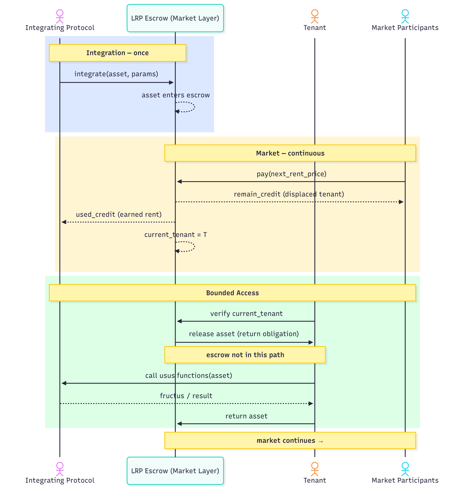

---

## 3. Asset State Flow (High-Level View)

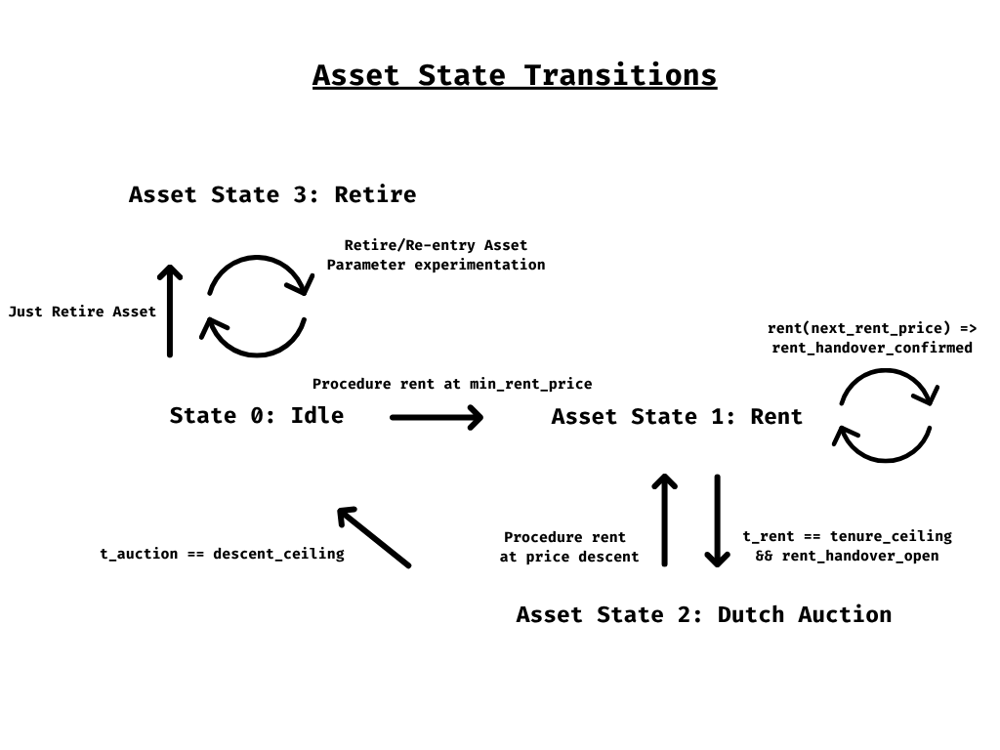

The lifecycle of an asset within the Liquid Renting protocol is governed by a strict state flow. This model ensures that the transfer of usus and fructus executes predictably, maintaining continuous liquidity of the asset.

The following details the state machine through which any integrated asset transitions:

### 1. State Definitions (Asset States)

**State 0: Idle (Baseline / Price Floor):**
The entry or resting state. The asset is available at or above `min_rent_price`. No usage right is committed. The usus and fructus are waiting for a first tenant to inject the liquidity necessary to activate the protocol.

**State 1: Rented (Position Secured):**
The tenant has acquired the monopoly over usus and fructus through upfront liquidity injection. In this state, the tenant does not trade the asset — they enjoy its utility while their position remains active. The injected liquidity is bound to the asset. This state has two sub-states:

- **rent_handover_open:** No next tenant has paid yet. The current tenant holds usus and fructus with no pending displacement.
- **rent_handover_confirmed:** A new tenant has paid `next_rent_price`. The `handover_countdown` is running. The current tenant retains usus and fructus until the countdown expires, at which point access transfers to the last tenant who placed a valid bid.

**State 2: At Dutch Auction (Price Discovery):**
A market rebalancing mechanism. If the asset is no longer rented and the market does not validate the last known rental price, a descending Dutch Auction is triggered. The goal is to perform a dynamic liquidation of the rental price until a new equilibrium is found where demand once again absorbs the usus of the asset.

**State 3: Retired (Off-boarding):**
The exit state from the protocol. An asset can only be retired when it is in the Idle state (no active usage commitments). At this point, the integration module revokes rental permissions and the usus/fructus is reintegrated into the absolute domain (abusus) of the original issuer or owner, exiting the protocol's liquidity circuit.

### 2. State Transitions

The flow of the asset between states obeys strict rules of liquidity and time, ensuring the market always has the final word on the value of the usus.

**Idle ➔ Rented (Initial Activation):**
A user injects any amount `P_entry ≥ min_rent_price`. This amount becomes the new `last_rent_price`. The protocol assigns the usus and fructus, initiating a rental time block that is fixed and immovable by the protocol's architecture.

**Rented ↺ (Takeover / Market Relay):**
Even while the asset is rented, its usus remains liquid. If the market values the asset above the current price, a new tenant can inject liquidity at a higher price. In doing so:

- The last known rental price in the protocol is updated.
- A new full time block is initialized for the new tenant.
- The displaced tenant is economically compensated: they receive their `remain_credit` — the value of unused time still locked in the protocol.

The transfer of access rights is governed by the `handover_countdown`, detailed in Section 5.

**Rented ➔ At Dutch Auction (Exhaustion and Liquidation):**
This transition requires two conditions to be true simultaneously: the current tenant's time block is exhausted (`remain_credit = 0`) AND the asset is in the `rent_handover_open` sub-state. If a next tenant has already paid (`rent_handover_confirmed`), access transfers directly to them at `handover_countdown_expiry` — the Dutch Auction is bypassed entirely, as demand is already confirmed.

**At Dutch Auction ➔ Rented (Price Discovery):**
During the auction, a new buyer accepts the current descending price and injects the required liquidity. They automatically assume the usus of the asset, initiating a new time block and returning the system to State 1.

**At Dutch Auction ➔ Idle (Lack of Demand):**
If the auction descends to the lower bound (price floor) and the market does not absorb the asset, it returns to the Idle state, waiting for reactivation.

**Idle ➔ Retired (Delisting):**
From the resting state, the integration module evaluates the asset's situation. If it determines that no real market or genuine interest exists to justify its continued presence, it executes the asset's permanent withdrawal from the protocol.

**Idle ↺ Retired (Parameter Reconfiguration):**
The retire → re-integrate cycle is the protocol's only mechanism for changing integration parameters. The owner retires the asset from `Idle`, adjusting any parameters, and re-introduces it — which places the asset back into `Idle` under the new configuration. This cycle is the natural feedback loop for integrators experimenting with incentive shapes: poor parameters drive the asset to `Idle` frequently, making reconfiguration fast and low-cost. The protocol is forgiving by design — wrong parameters surface quickly and the correction path is always available.

---

## 4. Asset State Flow (Low-Level View)

At a deeper level, the Liquid Renting architecture operates as a dynamic equilibrium system between consumed time and market valuation.

### 1. The Resting State (State 0: Idle)

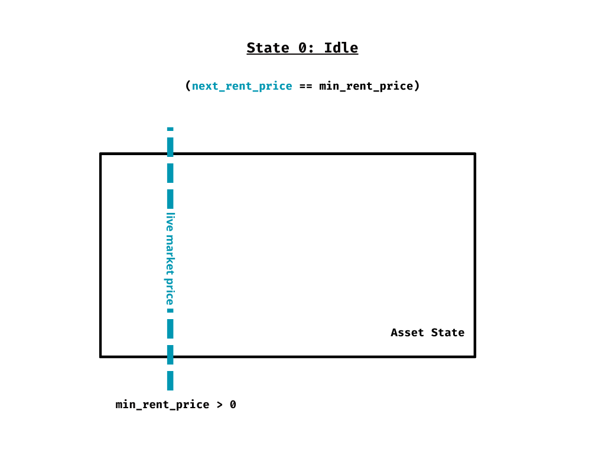

The initial equilibrium point. The asset is "open" with no incumbent and no liquidity barrier protecting its usus. Any amount `P_entry ≥ min_rent_price` is a valid entry price; `min_rent_price` is the floor, not a forced price.

### 2. The Credit Ascent and Takeover Cycle (State 1: Rented)

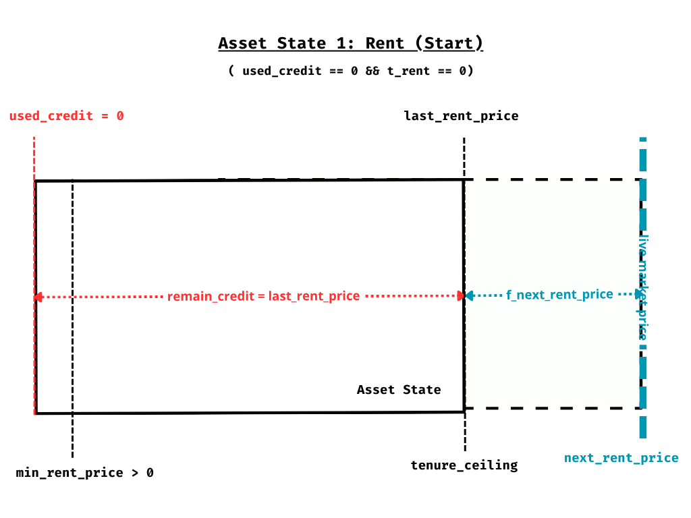

Once a user injects liquidity, the asset enters a state of active utilization that is, by definition, a renewable cycle:

**Price as Entry Barrier:** When renting the asset, the user purchases at next_rent_price(), establishing a new last_rent_price. This value acts as a physical liquidity barrier: any other actor wishing to access the usus of the asset must "clear" this barrier by injecting capital greater than next_rent_price(). A higher price than next_rent_price() is allowed.

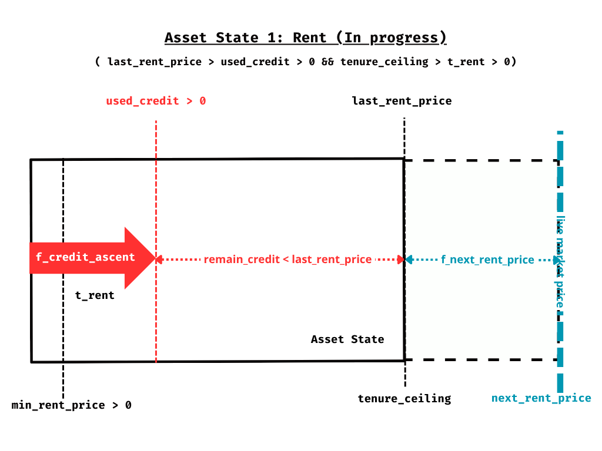

**The Takeover Dynamic (Cycle Reactivation):** If a new renter pays a higher price before the time runs out, the cycle restarts instantaneously:

- The new price becomes the new "barrier" (last_rent_price).
- `f_credit_ascent` resets to zero.
- The new tenant's credit block is initialized at their full entry price P(n+1) — unconsumed, starting from zero.

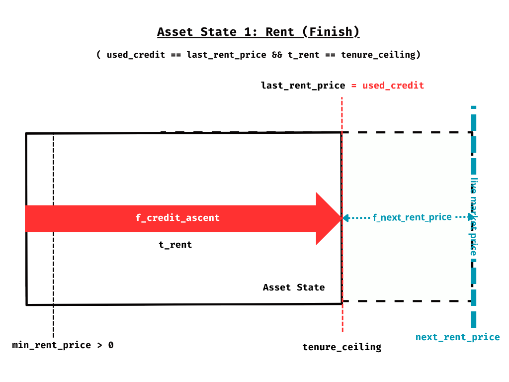

**The Trigger:** The transition to auction only occurs if the market does not validate the last_rent_price known. That is, if no one clears the barrier established by the last tenant before their used_credit reaches the limit of last_rent_price. In practice, the current tenant only reaches the end of the road if they were the last one to establish last_rent_price.


### 3. Price Discovery (State 2: At Dutch Auction)

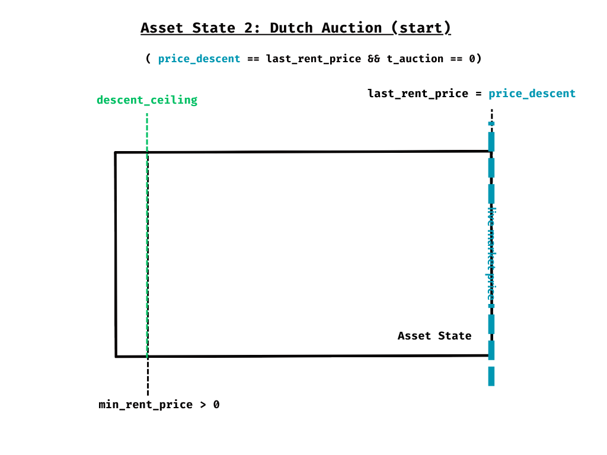

When the entry barrier (the price) proves too high for current demand and the last tenant's used_credit is exhausted, the protocol initiates the liquidation:

**Descent Strategy (Green Arrow):** The price_discovery_strategy begins eroding the entry barrier. The price_descent descends from the last known maximum.

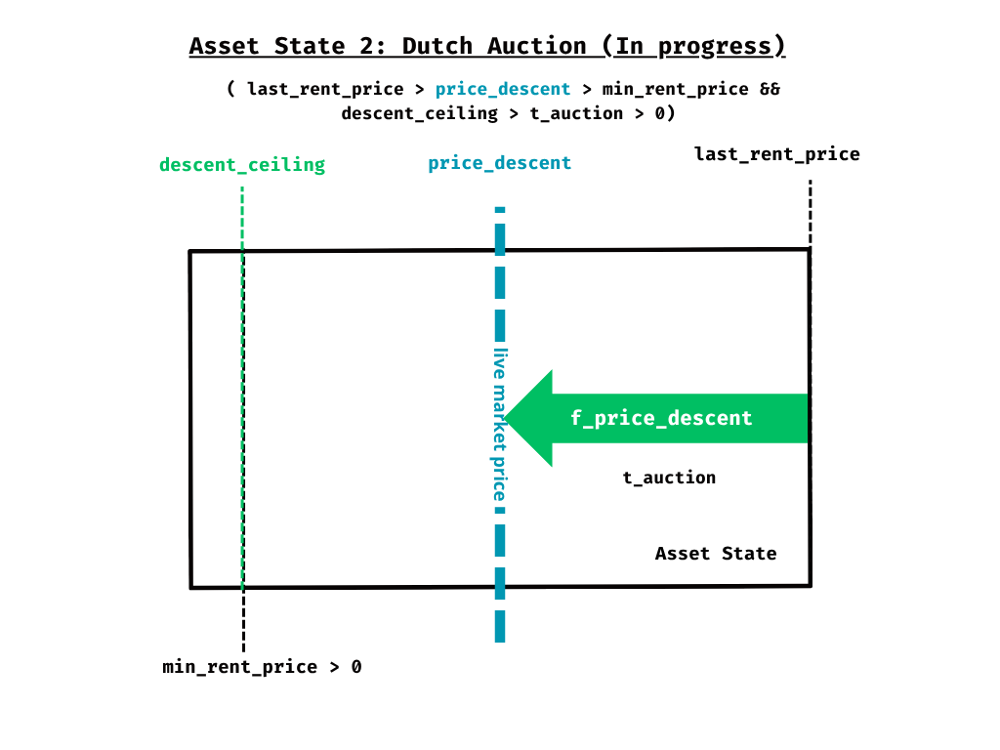

**Resolution:** The moment the descending price reaches a point the market finds attractive, a new user injects that liquidity, the asset returns to State 1, and a new entry barrier is established — restarting the utility cycle. Otherwise, the price_descent equals the min_rent_price and the asset enters the Idle state.

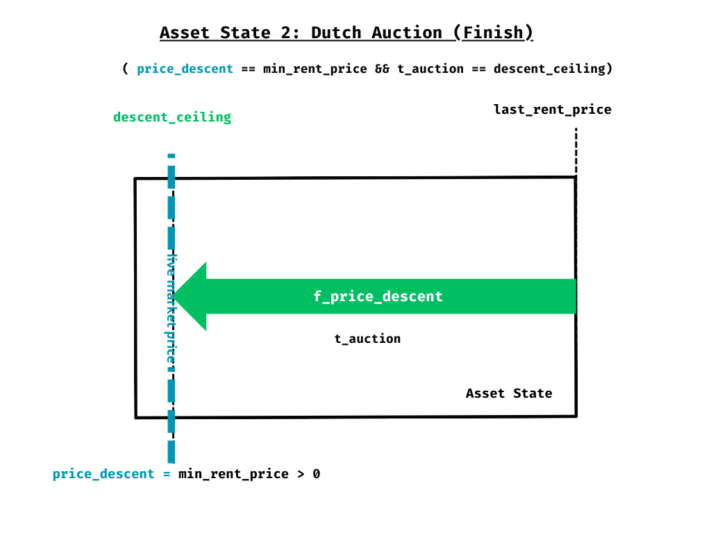

---

## 5. Asset Custody and Access Model

### The Protocol as Escrow

The Liquid Renting Protocol takes full custody of the asset at the moment of integration, wrapping it into a shared object that the protocol governs exclusively. From that point, the protocol acts as the authoritative escrow — it is the sole entity responsible for determining who has access to the asset at any given moment, based strictly on the state machine.

**Access to the asset is the delivery mechanism.** The protocol maintains a `current_tenant` designation that updates lazily with each state transition. Whoever the state machine designates as `current_tenant` has the usus and fructus. The protocol does not need to know what the asset produces or how it is used — it only needs to govern who can access it and when.

### The OwnerCap

At integration time, the protocol mints an `OwnerCap` object with `key + store` abilities — freely transferable by its holder. Possession of the `OwnerCap` is the sole verification mechanism for all owner-privileged operations: withdrawing accumulated `used_credit`, setting or unsetting the `to_retire` flag, and invoking `force_retire()`.

**`used_credit` accumulates, not flows.** Rather than pushing earned rent to an owner address at each takeover — which would require the protocol to track who holds the `OwnerCap` at every state transition — `used_credit` accumulates as a balance inside the escrow. The `OwnerCap` holder withdraws it actively at any time by presenting the cap in a dedicated withdrawal call. This decouples takeover execution from owner wallet state entirely: the protocol never needs to know who the owner is.

**Mutual exclusivity.** The `OwnerCap` and the asset can never be held simultaneously by the same actor. At integration, the asset enters the escrow and the `OwnerCap` is issued to the integrating party — from that moment, the escrow holds the asset and the cap circulates freely. At retirement, the asset is returned to the caller and the `OwnerCap` is burned unconditionally. No retired asset retains a live `OwnerCap`; no live `OwnerCap` exists without its asset in escrow.

**Transferability and the delegation model.** Because the `OwnerCap` has `key + store`, the owner role is freely assignable — the cap can be sold, delegated, or transferred independently of any underlying asset system. Whoever holds it at the moment of a withdrawal or retirement call is the legitimate owner for that operation. The protocol has no concept of "original integrator" — only current cap holder.

**Loss of the `OwnerCap`.** If the `OwnerCap` is lost or destroyed, all owner-privileged operations become permanently inaccessible. The asset remains locked in escrow for the duration of its rental lifecycle — tenants continue to hold and use it normally — but no retirement path can execute and accumulated `used_credit` cannot be withdrawn. This risk is the owner's to manage; it is the natural consequence of a capability-based access model and falls outside the protocol's control.

### The OwnerCap as Asset: The Recursive Property That Allows Emergent Sale

Because the `OwnerCap` carries `key + store` abilities, it satisfies the integration requirements of the protocol — it is a freely transferable object with an exercisable usus. This makes it a valid asset in a new escrow instance, producing a composable pattern that emerges naturally from the capability model.

**Level 1 — the base case.** An external asset enters the escrow. The protocol issues `OwnerCap_1` to the integrating party. Tenants compete for the usus of the asset. `OwnerCap_1` floats freely in the market, representing the right to claim accumulated `used_credit` and control the asset's lifecycle.

**Level 2 — the emergent case.** `OwnerCap_1` itself may be deposited into a new escrow instance. Tenants compete for its usus — the temporary right to act as owner of the level 1 escrow: withdrawing accumulated `used_credit` and exercising retirement rights. The level 2 tenant holds, for the duration of their block, the full administrative authority over the level 1 escrow.

**Implicit sale of the underlying asset.** When the level 1 escrow is in `Idle` or `At Dutch Auction`, a level 2 tenant may borrow `OwnerCap_1`, call `retire()` or `force_retire()`, and receive the underlying asset directly within a single Programmable Transaction Block — atomic and immediate. `OwnerCap_1` is returned to the level 2 escrow, now governing an empty instance. When the level 1 asset is in `Rented` state, `force_retire()` is deferred: the flag is set but the asset does not exit until the active block concludes. In this case, the tenant who initiated the retirement and the tenant who ultimately receives the asset may be different actors — a property explored in the subsection below. In all cases the operation is protocol-valid: the protocol cannot distinguish between a tenant exercising the usus to claim `used_credit` and a tenant exercising it to retire the asset. Both are legitimate uses of the same capability.

What has occurred is a de facto transfer of the abusus — and with it, the full dominium over the underlying asset. The protocol was designed to leave the abusus with the owner at all times. No rule has been violated: the owner of `OwnerCap_1` freely chose to make it available as a rentable asset, knowing that its usus includes retirement rights. The transfer of the abusus emerged from that choice, mediated by the market. The protocol did not design for sale — it discovered that ownership transfer is a special case of capability transfer.

**The depth restriction.** The pattern is valid at depth 2 — an `OwnerCap` whose escrow contains a real asset. It is prohibited at depth 3 — an `OwnerCap` whose escrow asset is itself another `OwnerCap`. The protocol enforces this at integration time: if the asset being integrated is an `OwnerCap`, the protocol verifies that its underlying escrow asset is not itself an `OwnerCap`. Integration is rejected otherwise.

The rationale is direct. At depth 3, the level 3 tenant could retire `OwnerCap_2` from its escrow — obtaining a capability that governs a level 1 escrow whose own underlying asset may already have been extracted, retired, or decoupled. The chain of value becomes opaque: the level 3 escrow makes claims about an asset it cannot directly observe. The depth restriction is not a constraint against composability — it is a guarantee that every escrow in the protocol is always one level of indirection from a real asset. The market can only price what it can observe.

### Access by State

The asset lives inside the protocol's shared object for its entire lifecycle. What changes across states is not the asset's location but who the protocol designates as `current_tenant`.

| State | Access granted to |
|---|---|
| `Idle` | No one — asset in escrow, awaiting a new tenant |
| `Rented` (`rent_handover_open`) | Current tenant — exclusive access, no pending displacement |
| `Rented` (`rent_handover_confirmed`) | Current tenant — exclusive access until `handover_countdown_expiry`, at which point access transfers automatically to the last bidder |
| `At Dutch Auction` | No one — asset in escrow, price descending |
| `Retired` | Integrating protocol — asset unwrapped from escrow and returned |

### Access Transitions

The asset physically moves only twice in its entire lifecycle: when it enters the escrow at integration and when it exits at retirement. Every other transition is an access control update resolved lazily within the shared object.

1. **Integration:** The owner wraps the asset into the protocol's shared escrow. The asset enters the shared object — this is the only physical ingress.
2. **Idle → Rented:** The first tenant pays `P_entry ≥ min_rent_price`. The protocol designates them as `current_tenant`. Access is granted.
3. **Handover at `handover_countdown_expiry`:** The state machine automatically transfers `current_tenant` from Tn to the last bidder T(n+1). No explicit call is required — any subsequent transaction that touches the shared object resolves this lazily.
4. **Rented → At Dutch Auction:** Tn's `used_credit` exhausts in `rent_handover_open`. The protocol clears `current_tenant` and begins the Dutch Auction.
5. **At Dutch Auction → Rented:** A new tenant pays the current `price_descent`. The protocol designates them as `current_tenant`. Access is granted.
6. **Retirement:** The owner requests retirement from `Idle`. The asset is unwrapped from the escrow and returned to the integrating protocol — the only physical egress.

### Fructus as a Natural Consequence

Because the protocol maintains an unambiguous `current_tenant` designation at every moment, access to the asset's fructus is always well-defined. The tenant exercises fructus by calling the integrating protocol's functions directly, using the asset as the legitimate holder during the bounded access window. Fructus is always an active operation — the tenant must initiate it. The protocol does not intermediate or accumulate yield; it only determines who holds access and for how long. The state machine determines who may capture fructus; the tenant captures it by exercising that access.

**Yield-bearing assets are supported naturally by this model.** For assets whose integrating protocol accumulates yield over time — fees, interest, rewards — that yield accrues in the integrating protocol's own state, not in the Liquid Renting escrow. The Liquid Renting Protocol has no visibility into this accumulation and requires none. When a tenant holds access, they may call the integrating protocol's yield-claiming functions at any moment, recovering all yield accumulated since the previous claim — including yield that accrued during vacant periods (`Idle` or `At Dutch Auction`) when no tenant was present to claim it. The first tenant to gain access after a vacant period therefore captures the full accumulated yield as a natural consequence of being the first legitimate holder of the asset key. This creates an incentive to end vacant periods — price and accumulated yield move in opposite directions during a Dutch Auction, making entry increasingly attractive over time — without the Liquid Renting Protocol tracking, distributing, or reasoning about yield at any point.

### The Escrow as Custodian with Bounded Access

The shared object escrow is not a passive vault, nor does it forward or intermediate calls. It grants and reclaims.

The integrating protocol defines an asset with its own set of functions: operations that encode what it means to *use* that asset — claiming fees, exercising governance rights, accessing a data feed, deploying capital. These functions are callable only by whoever legitimately holds the asset. The escrow becomes the legitimate holder at integration time and never relinquishes that position between operations.

When the current tenant wants to exercise the usus of the asset, the escrow releases it temporarily under a binding obligation of return. The tenant interacts with the integrating protocol directly, using the asset as its legitimate holder for the duration of the operation. At the close of the operation, the asset returns to escrow — not by negotiation, but by the structural guarantee of the access mechanism itself.

The escrow exercises no judgment over what the tenant does during this window. It knows nothing about the integrating protocol's functions, the nature of the usus, or what the operation produces. Its role is prior and posterior to the operation: *who may access*, and *that access ends*.

This is what makes the protocol a genuine primitive. The escrow's ignorance of the asset's semantics is not a limitation — it is the design. Any asset whose usus is exercisable by its holder is integrable, regardless of domain or complexity. The integrating protocol defines the semantics of the asset; the Liquid Renting Protocol defines who holds it and for how long.

---

## 6. Tenant Compensation Mechanism

The compensation mechanism is the economic guarantee that makes liquid renting viable. It ensures that any displaced tenant always recovers the unused portion of their payment, and that the incentive to enter the rental market remains rational at every price level.

The compensation is strictly bounded by the tenant's own stake. No price appreciation flows to displaced tenants — the protocol deliberately excludes this. Displacement is a neutral-to-negative economic event for the outgoing tenant: they recover `remain_credit` and absorb `used_credit` as the cost of the time they held the asset. This design is a direct consequence of the utility-grounded value principle: if a tenant's motivation is the usus and fructus of the asset, displacement interrupts that utility and the partial refund is fair compensation. If a tenant's motivation is speculation on price appreciation, the protocol offers no support for that strategy.

### 1. The Consumption Function

At the core of the mechanism lies the `f_credit_ascent` function. This function couples time and credit into a single unified variable: as time elapses, the used credit grows, and the remaining credit shrinks. The function is defined to pass through two fixed points:

- `(t = 0, consumed = 0)` — at the start of a rental, no credit has been consumed.
- `(t = T_rent, consumed = Pn)` — at the end of the rental period, all credit is exhausted.

This means time and credit are not independent: **when the clock runs out, the credit is exactly zero**. The two conditions are one and the same event seen from two dimensions. The exact shape of the curve between these two points (linear, convex, concave) is defined by the `f_credit_ascent` and will be detailed in the Incentive-driven Functions section.

At any moment during an active rental, the following invariant holds:

```
used_credit + remain_credit = Pn
```

### 2. Takeover and Compensation

While a tenant Tn holds the usus at price Pn, the asset remains liquid. Any market participant may displace Tn by injecting a new price `P(n+1) > Pn`. When this occurs:

**Tn receives:**
- `remain_credit` — the unused portion of their own locked payment, returned directly from the protocol.

**The asset owner (integrating protocol) receives:**
- `used_credit` — the portion of Pn that corresponds to time already consumed. This is the rent earned for the usus already delivered.

**T(n+1)'s new rental block:**
- T(n+1) injects `P(n+1)`, which is locked in full as their rental stake. The `f_credit_ascent` function resets and runs from `(t=0, 0)` to `(t=T_rent, P(n+1))`.

### 3. Invariants and Guarantees

**The displaced tenant always recovers unused time.** Since the takeover can only occur while `remain_credit > 0` (i.e., before time expires and the Dutch Auction is triggered), Tn always receives a strictly positive refund. A net loss relative to the entry price is possible when significant credit has already been consumed — the guarantee is that the displaced tenant always receives something, not that they profit from displacement.

**The pattern is symmetric.** For any sequence of tenants T1, T2, ..., Tn at prices P1 < P2 < ... < Pn:

| Event | Tenant receives | Owner receives |
|---|---|---|
| T2 displaces T1 at P2 | `remaining_T1` | `used_T1` |
| T3 displaces T2 at P3 | `remaining_T2` | `used_T2` |
| Tn displaces T(n-1) at Pn | `remaining_T(n-1)` | `used_T(n-1)` |

**Each new block is fully funded.** T(n+1) injects `P(n+1)`, which is locked in full as their rental stake. The consumption function runs from `(t=0, 0)` to `(t=T_rent, P(n+1))`. The displaced tenant Tn receives only their `remain_credit` from their own previously locked stake — no delta flows from the incoming payment. The arithmetic is exact: Tn's `used_credit` goes to the owner, Tn's `remain_credit` returns to Tn, and T(n+1)'s `P(n+1)` is held in full as their new stake.

### 4. Dutch Auction as Boundary Condition

If no T(n+1) arrives before Tn's time expires, `used_credit` reaches `Pn` and `remain_credit` reaches zero simultaneously. There is no remaining stake to return to Tn — it has been fully delivered to the owner as earned rent.

At this point, the Dutch Auction is triggered. It carries no stake of its own. Its sole function is to prevent the last known price Pn from freezing as the market entry barrier, allowing the price to descend until a new tenant finds it attractive and injects liquidity, restarting the cycle.

### 5. The Handover Countdown

#### Definition

When a new tenant T(n+1) pays `next_rent_price`, the asset transitions to `rent_handover_confirmed`. At that moment, the protocol draws a random duration `r` from Sui's on-chain randomness module and stores `handover_countdown_expiry`:

```
r       ~ Uniform[r_min, r_max]
r_min   = min(handover_floor, remaining_rent_time)
r_max   = min(handover_ceiling, remaining_rent_time)

handover_countdown_expiry = t_bid + r
```

Where `handover_floor` and `handover_ceiling` are protocol-level parameters constrained by:

```
0 < handover_floor ≤ handover_ceiling ≤ tenure_ceiling
```

Once sampled, `handover_countdown_expiry` is a fixed timestamp — a phase anchor stored in the shared object at bid time. Subsequent bids during the window do not resample it.

#### Design Rationale: The Candle Auction

The random expiry is a deliberate design choice to eliminate last-second sniping.

In an auction with a known, fixed deadline, rational actors have a structural incentive to time their bids at the last possible moment — minimizing the window in which opponents can respond. This concentrates bid activity at the deadline, collapsing the competitive window to its final instants. Actors with lower-latency infrastructure gain an advantage unrelated to their valuation of the asset.

The candle auction removes this incentive entirely. Because `handover_countdown_expiry` is unknown to all participants at the time of their bid, there is no optimal moment to delay. An actor who waits risks the candle firing before their bid arrives. The rational strategy is to bid when you decide to participate — not when the clock forces you to.

This produces three market properties:

- **Higher bid volume:** bids are distributed across the full competitive window rather than concentrated at the deadline.
- **Level playing field:** capital is the only structural advantage. Infrastructure speed confers no benefit.
- **Heterogeneity of actors:** the market is accessible to all participants regardless of technical sophistication.

`handover_floor` and `handover_ceiling` give the integrator control over the shape of the competitive window: a narrow window (`handover_floor ≈ handover_ceiling`) approaches deterministic behavior; a wide window maximizes the candle's anti-sniping effect at the cost of greater uncertainty for both Tn and T(n+1).

#### Dual Guarantee

The `handover_countdown` serves two roles simultaneously:

- **For the current tenant Tn:** a guaranteed minimum window of usus and fructus after being displaced. The candle cannot fire before `handover_floor` — the protocol cannot transfer access before this point, regardless of where the random sample falls. Tn knows they will retain access for at least `handover_floor`; they may retain it longer.
- **For the asset owner:** a guaranteed minimum `used_credit`. Since `f_credit_ascent` keeps running throughout the countdown, the owner earns at least the rent corresponding to `handover_floor`. If the candle fires later, the owner earns proportionally more.

#### Consumption During the Countdown

The `f_credit_ascent` function continues running throughout the `handover_countdown`. Tn retains full access — and therefore usus and fructus — until `handover_countdown_expiry`. As a consequence, Tn's `remain_credit` at the moment of handover is lower than at the moment T(n+1) paid — the difference is additional earned rent for the owner.

#### Multiple Bids During the Countdown

The asset continues accepting new bids while in `rent_handover_confirmed`. If T(n+1), T(n+2), ... all pay during the competitive window:

- `handover_countdown_expiry` does not change — it was fixed at the moment of the first bid and is not resampled.
- Each intermediate bidder (all except the last at the moment the candle fires) receives their full injection returned immediately.
- Access transfers to the **last** tenant who placed a valid bid before the candle fired.
- Tn's compensation is calculated at `handover_countdown_expiry`: `remain_credit_at_handover` — the unused portion of their stake at the moment access transfers.

#### New Tenant's Cycle

T(n+1)'s rental cycle — and their `f_credit_ascent` clock — begins at `handover_countdown_expiry`, not at payment. This timestamp is fixed at the moment T(n+1) pays and stored as a phase anchor — it is not known to T(n+1) in advance, but is deterministic from that point onward. The state machine automatically designates T(n+1) as `current_tenant` at that timestamp. No explicit claim is required — the transition is resolved lazily by the next transaction that touches the shared object.

T(n+1) has direct economic incentive to interact as soon as possible after the candle fires: their `f_credit_ascent` clock begins at `handover_countdown_expiry`, not at the moment of their first transaction. Every second they delay is a second of their paid tenure that passes without access.

#### Dutch Auction Bypass

When `r_min = r_max` — which occurs when `remaining_rent_time ≤ handover_floor` — the candle range collapses to a single point and `handover_countdown_expiry` is deterministic: `t_bid + remaining_rent_time`. The countdown exhausts Tn's remaining time exactly, `remain_credit` reaches zero at handover, and the asset passes directly to the confirmed next tenant — the Dutch Auction is never triggered. The `rent_handover_confirmed` sub-state is proof of existing demand, making price discovery unnecessary.

#### Edge Cases

- **`handover_floor = handover_ceiling`:** The candle range collapses to a single point. The countdown duration is deterministic — equivalent in behavior to the fixed-countdown design, with no randomness exercised.
- **`handover_floor = handover_ceiling = tenure_ceiling`:** The countdown equals the full rental block. The current tenant is guaranteed the entirety of their remaining time before any handover — equivalent in behavior to a traditional fixed-term lease, with the liquid renting compensation mechanics preserved.

---

## 7. Incentive-driven Functions

The Liquid Renting Protocol exposes a set of pluggable functions that govern the economic behavior of the protocol without prescribing a single strategy. Each function must satisfy a set of formal constraints, but its exact shape is left to the integrating protocol, which selects it according to the market behavior it wishes to incentivize.

The three functions are the only configuration points of the protocol. Their responsibilities are exclusive and non-overlapping — the integrating protocol selects each one independently without risk of interference between them:

| Function | Active state | Price direction | Independent variable |
|---|---|---|---|
| `f_credit_ascent` | Rented | — (consumes credit) | time |
| `f_price_descent` | At Dutch Auction | descends only | time |
| `f_next_rent_price` | Rented (takeover) | ascends only | price |

Price can only descend in one place in the protocol: the Dutch Auction. Everywhere else, it ascends or holds.

---

### 6.1 `f_credit_ascent(t_rent)`

#### Purpose

This function defines the rate at which a tenant's rental credit is consumed over the duration of their rental period. It is the mechanism that couples time and economic stake into a single unified variable.

#### Formal Definition

The integrating protocol provides a normalized shape function:

```
g : [0, 1] → [0, 1]
```

The protocol scales it to the current price and time parameters to compute credit consumption at any moment:

```
used_credit(t) = last_rent_price · g(t / tenure_ceiling)
```

This separation is the correct interface. Parameters are fixed at integration time but `last_rent_price` varies with each takeover cycle — the integrator cannot specify a function with a price-dependent codomain at integration time. What the integrator controls is the shape; the protocol handles the scaling.

#### Constraints

The shape function `g` must satisfy the following conditions:

1. **Origin:** `g(0) = 0` — at the start of the rental, no credit has been consumed.
2. **Termination:** `g(1) = 1` — at the end of the normalized period, all relative credit is exhausted.
3. **Boundedness:** `∀ x ∈ [0, 1] : 0 ≤ g(x) ≤ 1` — the function is always contained within the unit square.
4. **Monotonicity:** `g` is strictly monotonically increasing.

Any function satisfying these four constraints is a valid implementation. The constraints are price-independent: the integrator can verify them once at integration time, without knowledge of any future `last_rent_price`.

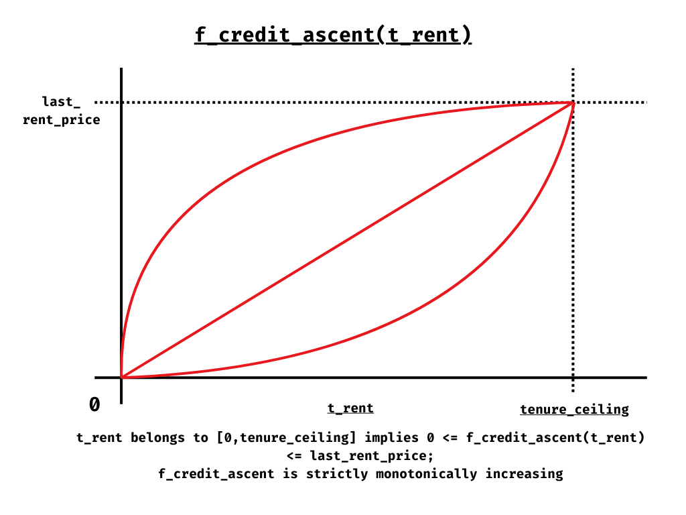

#### The Dutch Auction Trigger as a Corollary

Constraints (1), (2), (3), and (4) together imply that time exhaustion and credit exhaustion are the same event. When `t = tenure_ceiling`, `g(1) = 1` by constraint (2), so `used_credit = last_rent_price · 1 = last_rent_price` — meaning `remain_credit = 0` at the exact moment the clock reaches zero. These two conditions are not independent; they are two projections of the same point `(1, 1)` in the normalized space, scaled to `(tenure_ceiling, last_rent_price)` by the protocol. The Dutch Auction is therefore triggered when either description is satisfied — they are equivalent.

#### Bijectivity as a Consequence

`g` is a strictly monotonically increasing function with fixed endpoints on `[0, 1]` — it is therefore a bijection:

```
g : [0, 1] ↔ [0, 1]
```

By the linearity of the scaling, the composed function inherits this bijectivity:

```
f_credit_ascent : [0, tenure_ceiling] ↔ [0, last_rent_price]
```

This means **time and `used_credit` are equivalent representations of the same state**. For any value of `used_credit` there is exactly one `t_rent` that produced it, and vice versa. The protocol can express any condition indifferently in terms of time or credit — both descriptions always have a unique, well-defined answer.

The inverse is guaranteed to exist for both `g` and the scaled function.

#### Incentive Implications of Curve Shape

The integrating protocol selects the curve shape to incentivize a specific market behavior:

**Concave curve (e.g., `g(x) = √x`):** Credit is consumed rapidly at the start and slowly toward the end. A tenant displaced early recovers little `remain_credit`. This penalizes speculative entry — entering with the expectation of a quick takeover and a large refund is costly, since the curve has already consumed most of the credit. Suited for protocols that want to discourage high-frequency rotation and reward sustained usage.

**Linear curve (`g(x) = x`):** Credit is consumed proportionally to time. The protocol takes no position on when rotation is more or less convenient. Agnostic and neutral.

**Convex curve (e.g., `g(x) = x²`):** Credit is consumed slowly at the start and accelerates toward the end. A tenant displaced early still holds a large `remain_credit`, making entry safer. This incentivizes rotation — the cost of entering is partially recoverable at any early point, lowering the risk of taking a position. Suited for protocols that want high liquidity and active price discovery.

> **Note:** The three behaviors above — concave, linear, and convex — cover the space of functions with constant curvature sign. They are the natural anchors for reasoning about incentive direction. Functions with an inflection point — such as the sigmoidal family described below — combine convex and concave segments and are not captured by this framing.

#### Concrete Function Families

Any function satisfying the four constraints is a valid implementation of `g`. The following families cover the practical design space and serve as concrete starting points for integrators.

**Power-law family: `g(x) = xᵅ`, α > 0**

The simplest parametric family. A single parameter controls the curvature continuously: `α < 1` produces a concave curve, `α = 1` is linear, `α > 1` is convex. The examples `g(x) = √x` (`α = 0.5`) and `g(x) = x²` (`α = 2`) from the incentive implications above are members of this family. Easy to reason about, easy to verify, and cheap to evaluate on-chain.

**Exponential family: `g(x) = (eᵅˣ − 1) / (eᵅ − 1)`, α ≠ 0**

A single parameter interpolates continuously between concave (`α < 0`), linear (`α → 0`), and convex (`α > 0`) behavior — the same curvature regimes as the power-law family, but with a different profile. Convex members of this family accelerate more sharply near `x = 1` than power-law equivalents with similar curvature near `x = 0`. For large `|α|`, the curve approaches the boundaries of the feasible region — valid by the constraints but approaching the degenerate step-function behavior described in Attack Vector 8.

**Sigmoidal family (S-curve): `g(x) = 3x² − 2x³`**

The canonical member is the cubic smoothstep. More generally, any strictly increasing function with a single interior inflection point. A parametric form via `tanh`:

```
g(x) = [tanh(α(x − 0.5)) − tanh(−α/2)] / [tanh(α/2) − tanh(−α/2)],  α > 0
```

As `α → 0`, this approaches linear. For finite `α`, the curve is convex on `[0, 0.5)` and concave on `(0.5, 1]`.

This family is not reachable by any member of the power-law or exponential families — its defining property is the inflection point. The curvature changes sign, so the curve is neither globally convex nor globally concave.

*Economic interpretation:* credit consumption is slow at the start of the block, accelerates through the middle, and slows again near the end. A tenant displaced early or late recovers most of their credit; a tenant displaced mid-block recovers the least. This structure suits protocols where the usus is most valuable at the boundaries of a block — governance epochs where decisions are made at the start and close, seasonal campaigns with a warm-up and wind-down, or any cycle where mid-period activity is operationally routine and displacement is least costly.

**Bernstein polynomial family**

For maximum expressiveness, any valid `g` can be approximated to arbitrary precision as a Bernstein polynomial of degree `n`:

```
g(x) = Σₖ₌₀ⁿ cₖ · Bₖ,ₙ(x)

Bₖ,ₙ(x) = C(n,k) · xᵏ · (1−x)ⁿ⁻ᵏ
```

The four constraints translate directly to conditions on the coefficient vector: `c₀ = 0`, `cₙ = 1`, and `c₀ < c₁ < c₂ < ··· < cₙ` (strictly increasing). Any desired credit-consumption profile can be expressed as a Bernstein polynomial of sufficient degree, with constraint satisfaction guaranteed by construction from the coefficient conditions alone. This is the correct family when an integrator's incentive requirements are complex enough that no single-parameter family suffices.

---

### 6.2 `f_price_descent(t_auction)`

#### Purpose

This function defines the rate at which the `price_descent` decays during a Dutch Auction. It is the symmetric counterpart to `f_credit_ascent`: where the first function drives a value upward from zero to a ceiling, this function drives a value downward from a ceiling to a floor.

#### Formal Definition

The integrating protocol provides a normalized shape function:

```
h : [0, 1] → [0, 1]
```

The protocol applies it to the current price parameters to compute the auction price at each moment:

```
price_descent(t) = last_rent_price - (last_rent_price - min_rent_price) · h(t / descent_ceiling)
```

`h` encodes how deep into the discount range the auction has progressed at any normalized time `x = t / descent_ceiling`. At `x = 0`, `h(0) = 0` — no discount yet. At `x = 1`, `h(1) = 1` — the full discount is applied and the price reaches `min_rent_price`.

#### Constraints

The shape function `h` must satisfy the following conditions:

1. **Origin:** `h(0) = 0` — the auction begins with no discount applied; the entry price equals `last_rent_price`.
2. **Termination:** `h(1) = 1` — if no buyer is found, the full discount is applied and the price reaches `min_rent_price`.
3. **Boundedness:** `∀ x ∈ [0, 1] : 0 ≤ h(x) ≤ 1` — the function is always contained within the unit square.
4. **Monotonicity:** `h` is strictly monotonically increasing — the discount only deepens, never reverses.

Any function satisfying these four constraints is a valid implementation. As with `g`, the constraints are price-independent and can be verified once at integration time.

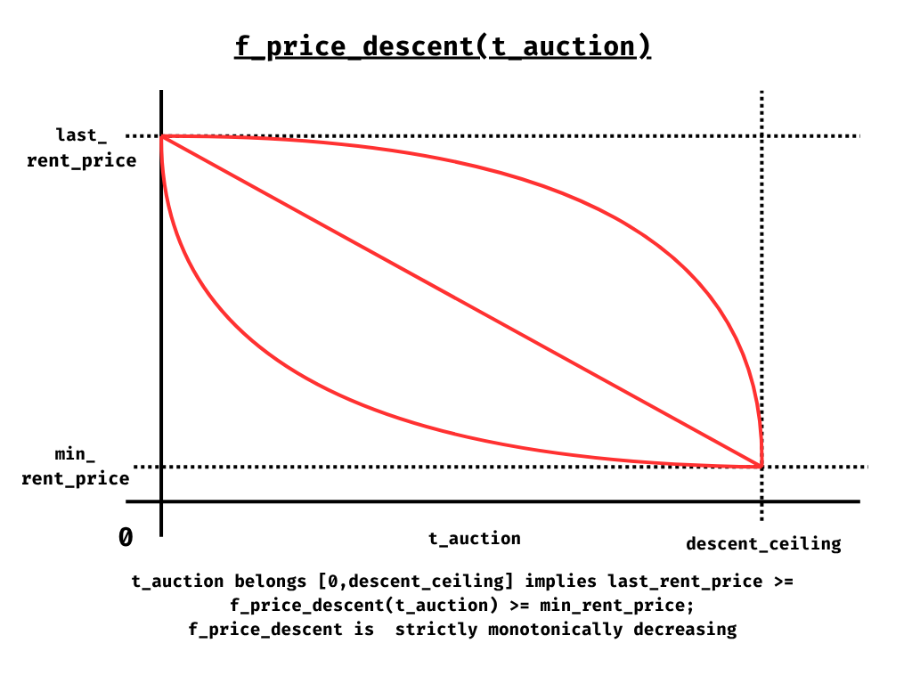

#### Symmetry with `g`

`g` and `h` are the same type of object. The integrator provides two normalized shape functions with an identical structural contract:

| | `g` (credit shape) | `h` (descent shape) |
|---|---|---|
| Type | `[0, 1] → [0, 1]` | `[0, 1] → [0, 1]` |
| Fixed point at 0 | `g(0) = 0` | `h(0) = 0` |
| Fixed point at 1 | `g(1) = 1` | `h(1) = 1` |
| Monotonicity | Strictly increasing | Strictly increasing |
| Protocol applies as | `last_rent_price · g(x)` | `last_rent_price - (last_rent_price - min_rent_price) · h(x)` |
| Economic effect | Credit consumed ascends | Auction price descends |

The direction of the economic effect — ascent vs. descent — comes entirely from how the protocol applies the shape, not from the shape itself. Both `g` and `h` are increasing functions. The asymmetry between credit and price lives in the protocol, not in the integrator's input.

This design decision — a shared type with identical constraints — is deliberate. The integrator reasons about one kind of object in both cases. The space of valid curves between two fixed points on `[0,1]` is already vast enough to express any incentive behavior the integrating protocol may require. Adding asymmetric constraint sets would increase cognitive load without expanding expressive power.

#### Bijectivity as a Shared Property

Both `g` and `h` are strictly monotonically increasing functions with fixed endpoints on `[0, 1]` — they are therefore bijections:

```
g : [0, 1] ↔ [0, 1]
h : [0, 1] ↔ [0, 1]
```

By the linearity of the respective scalings, the composed functions inherit this bijectivity:

```
f_credit_ascent  : [0, tenure_ceiling]  ↔ [0, last_rent_price]
f_price_descent  : [0, descent_ceiling] ↔ [min_rent_price, last_rent_price]
```

In both cases, **time and economic value are equivalent representations of the same state**. For `f_credit_ascent`, any `used_credit` value uniquely identifies an elapsed `t_rent`. For `f_price_descent`, any `price_descent` value uniquely identifies an elapsed `t_auction`. The inverse of each function is guaranteed to exist at both the normalized and scaled levels.

This collapses the state space: the protocol never needs to track both time and value independently — one always determines the other. Implementations can store whichever representation is cheaper on-chain and derive the other on demand.

#### Scaling Behavior and the Role of `last_rent_price`

Because the integrator provides the normalized shape functions `g` and `h`, scaling is the protocol's exclusive responsibility. As `last_rent_price` grows through successive takeovers, both applied functions scale accordingly — without any action from the integrator and without any change to `g` or `h`.

Both functions have a fixed range within their active state — the range does not change during execution. What grows across successive cycles is the amplitude of each function, because `last_rent_price` rises with each takeover:

- **`f_credit_ascent`** has amplitude `last_rent_price` (floor fixed at 0). At any given time fraction `t/T`, the absolute credit consumed scales proportionally with `last_rent_price`. A tenant who paid twice the price pays twice the rent per unit of time.

- **`f_price_descent`** has amplitude `last_rent_price - min_rent_price` (floor fixed at `min_rent_price`). At any given time fraction `t/T`, the absolute price shed scales proportionally with `last_rent_price - min_rent_price`. An auction that starts twice as high descends twice as fast in absolute terms per unit of time — the market must absorb proportionally larger price drops to find a new equilibrium.

The duality is symmetric: both functions are anchored by a fixed floor (0 and `min_rent_price` respectively) and a moving ceiling (`last_rent_price`). As the protocol's price history rises, both mechanisms scale their amplitude by the same reference point.

#### Consequences of the Scaling Behavior

**Owner revenue scales with market validation.** Since `used_credit` scales with `last_rent_price`, the owner earns proportionally more per block as the price rises through successive takeovers. Each cycle in which the market validates a higher price directly increases the rent generated for the owner. The protocol's revenue is self-calibrating: it is always proportional to the value the market assigns to the usus.

**The incumbent's burn rate rises with the price.** A tenant who entered at a higher `last_rent_price` consumes their stake faster in absolute terms per unit of time. Holding a more expensive position costs more per second — not just in total, but in the rate at which credit is earned by the owner. The cost of occupying the position is always proportional to its market price.

**The Dutch Auction is more aggressive at higher prices.** When `last_rent_price` is high, the auction sheds larger absolute amounts per unit of time. The market is not given more time to find equilibrium — it faces proportionally larger price drops within the same `descent_ceiling` window. An asset that the market priced high but then abandoned requires a more aggressive correction to return to activity.

**The protocol responds symmetrically to market activity and inactivity.** When the market actively validates prices through successive takeovers, `f_credit_ascent` scales up — the owner earns more and the incumbent pays more per unit of time. When the market withdraws and a Dutch Auction begins, `f_price_descent` scales up by the same reference point — the correction is as large as the ascent was. The two mechanisms are calibrated to the same price history, so the protocol's response to demand is always proportional to its own prior peak.

#### Incentive Implications of Curve Shape

The shape of the decay curve determines when buyers are incentivized to act during the auction:

**Concave curve (e.g., `h(x) = √x`):** The discount deepens sharply at the start and flattens toward the end. Most of the price reduction is captured early. Incentivizes buyers to act quickly — waiting yields diminishing returns.

**Linear curve (`h(x) = x`):** The discount deepens at a constant rate. Neutral. No moment in the auction is structurally more attractive than another.

**Convex curve (e.g., `h(x) = x²`):** The discount remains shallow for most of the auction and deepens steeply at the end. Incentivizes patient buyers to wait — the largest discounts arrive late. Creates a "cliff" dynamic near `descent_ceiling`.

> **Note:** The three behaviors above — concave, linear, and convex — cover the space of functions with constant curvature sign. Functions with an inflection point — such as the sigmoidal family — are not captured by this framing.

#### Concrete Function Families

`g` and `h` share the same type and the same constraints. Every family valid for `g` is equally valid for `h`. The power-law, exponential, sigmoidal, and Bernstein polynomial families defined in §6.1 apply without modification.

The economic reinterpretation for `h` is symmetric: where `g` governs *how fast credit is consumed by the tenant*, `h` governs *how fast the discount deepens toward the buyer*. The incentive shapes map as follows:

| Family | As `g` (credit ascent) | As `h` (price descent) |
|---|---|---|
| Power-law `xᵅ`, α < 1 (concave) | Credit consumed fast early — penalizes speculative entry | Discount deepens fast early — rewards acting quickly in the auction |
| Power-law `xᵅ`, α > 1 (convex) | Credit consumed slow early — incentivizes rotation | Discount deepens slow early — cliff dynamic, rewards patience |
| Exponential, α < 0 (concave) | Same as concave power-law, steeper deceleration near end | Same as concave power-law, steeper deceleration near end |
| Exponential, α > 0 (convex) | Same as convex power-law, sharper acceleration near end | Same as convex power-law, sharper acceleration near end |
| Sigmoidal | Displacement cheapest at block boundaries | Entry cheapest early and late in the auction; steepest discount mid-auction |
| Bernstein | Arbitrary profile, coefficient-specified | Arbitrary profile, coefficient-specified |

The sigmoidal family applied to `h` creates a "mid-auction cliff": the discount accumulates slowly at the start, accelerates sharply through the middle of the auction window, then flattens again near the end. Buyers who miss the mid-auction window see diminishing additional discount — a structure suited to protocols that want to concentrate competitive pressure in the middle of the price discovery window.

---

### 6.3 `f_next_rent_price(last_rent_price)`

#### Purpose

This function defines the minimum price a new tenant must inject to legally displace the current one. It is the protocol's sole anti-penny-jumping and anti-griefing mechanism, and the only force that drives prices upward during the Rented state.

#### Formal Definition

```
f_next_rent_price : last_rent_price → next_rent_price
```

The function is strictly one-dimensional. The only input is `last_rent_price`. No time variable, no state dependency.

#### Constraints

1. **Strict increase:** `f(last_rent_price) > last_rent_price` — the next price must always be strictly greater than the last.

Any function satisfying this constraint is a valid implementation.

#### Design Rationale: Why One Dimension

Two alternative designs were considered and rejected:

A time-dependent minimum increment — where the required premium decreases as the tenant's block is consumed — was discarded because it introduces a second price-lowering mechanism during the Rented state, competing directly with `f_price_descent`. In this protocol, price descent has exactly one owner: the Dutch Auction. During the Rented state, price only moves upward.

A minimum increment dependent on `remain_credit` was rejected for the same reason: as `remain_credit → 0`, the required increment approaches zero, implicitly encoding a time-based price reduction. Same redundancy, different variable.

The one-dimensional form is not a simplification — it is the correct design. Each function in the protocol has a single, non-overlapping responsibility.

#### The Increment as a Critical Design Parameter

The size of the increment defined by `f_next_rent_price` carries more weight in this protocol than it might initially appear. The self-renewal cost for the current tenant is:

```
renewal_cost = used_credit + (P(n+1) - Pn)
```

Where `(P(n+1) - Pn)` is the increment. This means the increment is **a direct component of the incumbent's defense cost**, not merely a barrier against external competitors. The integrating protocol must balance two competing forces:

**A small increment** (δ → 0): Self-renewal is cheap — the incumbent pays nearly `used_credit` to reset their block. However, a small increment also exposes the protocol to griefing — a well-funded actor can execute repeated takeovers at negligible cost, continuously disrupting tenants (Attack Vector 1).

**A large increment**: Self-renewal is expensive — the incumbent must pay significantly above `used_credit` to maintain their position. This weakens the structural advantage and makes sustained hold more capital-intensive. On the other hand, it accelerates genuine price discovery and makes the asset more accessible to competing market participants.

There is no universally correct increment. The integrating protocol must select a `f_next_rent_price` that reflects the specific competitive dynamics of the asset: how actively it is contested, the capital profile of expected participants, and how aggressively genuine price discovery should be driven.

#### The Renewal Mechanism as an Implicit Consequence

The protocol places no restriction on the identity of the new tenant. `f_next_rent_price` is evaluated against a price, not a party. This means the current tenant Tn is free to invoke a takeover against themselves, paying `P(n+1) = f_next_rent_price(Pn)`.

The mathematics of the compensation mechanism produce a clean result. Tn pays `P(n+1)` and simultaneously receives, as the displaced tenant, `remain_credit`. Their net cost is:

```
P(n+1) - remain_credit
= P(n+1) - Pn + used_credit
```

**The tenant pays the minimum increment plus what they have already consumed.** The unconsumed portion is returned, the block resets to `P(n+1)`, and the clock starts over.

---

## 8. The Renewal Mechanism

The renewal mechanism follows directly from three rules:

1. **The protocol is identity-agnostic.** `f_next_rent_price` is evaluated against a price, not a party. The protocol has no concept of "same address" or "different address."
2. **The last valid bidder wins.** During `rent_handover_confirmed`, access transfers to the last tenant who placed a valid bid before the `handover_countdown` expired.
3. **The displaced tenant always recovers unused time.** Any tenant displaced by a takeover receives `remain_credit`, returned from their own locked stake.

### The Mathematics of Self-Renewal

Suppose Tn holds the asset at price Pn, with some `used_credit` already accumulated. At any moment, Tn may invoke a takeover against themselves — paying `P(n+1) = f_next_rent_price(Pn)`.

The compensation mechanism processes this identically to any takeover. Tn pays P(n+1) and simultaneously receives, as the displaced tenant:

```
remain_credit
```

Their net cost is:

```
P(n+1) - remain_credit
= P(n+1) - Pn + used_credit
```

**The tenant pays the minimum increment plus what they have already consumed.** The unconsumed portion is returned, the block resets to `P(n+1)`, and the clock starts over from zero.

### The Structural Asymmetry — The Current Asset Tenant's Advantage

The renewal mechanism creates a structural cost asymmetry between the current tenant and any external competitor — without the protocol encoding it.

When an external actor T(m) pays `P(m+1)` and wins the asset, their net cost is `P(m+1)` — the full price of entry. They have purchased a new block at market price.

When the current tenant Tn self-renews at the same price, their net cost is `P(n+1) - remain_credit` — the minimum increment plus the rent already consumed. Their advantage over an external competitor is exactly `remain_credit`: the unused portion of their existing stake that returns to them, a discount no external actor can access.

This asymmetry is not a privilege granted by the protocol. It is a mathematical consequence of the fact that Tn is simultaneously the payer and the displaced party in the same transaction.

### Identity-Agnosticism and the Second-Wallet Game

Because the protocol does not verify identity, a single actor operating two addresses is indistinguishable from two competing actors. Tn may place a renewal bid from a second wallet — the protocol processes it as a standard takeover. The effect is identical: Tn pays `P(n+1) - remain_credit` net, the block resets, the price rises by the minimum increment.

This is not a loophole. It is the correct behavior. The protocol has no reason to distinguish between a self-renewal and a competitive takeover — both result in a valid new tenant paying a higher price. The market outcome is the same; only the identity of the recipient changes.

### Renewal as a Defensive Mechanism

The renewal mechanism is equally available during `rent_handover_confirmed`. If an external actor T(m) has already placed a bid — initiating the `handover_countdown` — Tn may counter-bid at `P(m+2) = f_next_rent_price(P(m+1))`.

When Tn counter-bids:
- T(m) receives their full `P(m+1)` injection back immediately — they are superseded.
- Tn, as the displaced tenant at Pn, receives `remain_credit`.
- Tn, as the new winning bidder at P(m+2), will be designated `current_tenant` when the `handover_countdown` expires.
- Tn's net cost: `P(m+2) - remain_credit`.

The current tenant can always neutralize a takeover attempt. Their structural advantage — `remain_credit` — is the discount they hold over any external competitor who must pay `P(m+2)` in full. This advantage is largest at the start of the block and shrinks as credit is consumed.

### The Competitive Bidding Window

The `handover_countdown` is not merely a grace period for the current tenant. It is an open competitive window during which any number of actors may bid for the asset. The rules are simple:

- Each new valid bid supersedes the previous one.
- The superseded bidder is refunded immediately and in full.
- `handover_countdown_expiry` is fixed at the moment of the first bid and does not change with subsequent bids.
- Access transfers to whoever holds the winning bid when the candle fires.

Because `handover_countdown_expiry` is unknown to all participants, there is no optimal moment to delay a bid. This creates a competitive window with bids distributed across its full duration rather than concentrated at a known deadline. The current tenant participates with a structural cost advantage — their net cost is always `P_bid - remain_credit`, strictly less than the full price any external bidder must pay. The advantage is proportional to `remain_credit`: maximum at the start of a block, approaching zero as the block nears expiry. The market resolves who values the position more.

### The Cost of Abusing the Defense

The structural advantage of the current tenant is real, but it is self-limiting. Each defensive counter-bid invokes `f_next_rent_price`, raising `last_rent_price` by the minimum increment. The tenant neutralizes the competitor — but anchors their new block to a progressively higher price.

If Tn counter-bids repeatedly against successive challengers, arriving at `P(n+k)`:

- Tn is now the last to have established `last_rent_price = P(n+k)` — the asset is in `rent_handover_open`.
- Their `f_credit_ascent` runs from `0` to `P(n+k)`, a ceiling far above their original entry.
- If the market does not validate this elevated price — if no new bidder arrives — Tn consumes their full block alone at the higher cost.

The price ladder that Tn used as a defensive weapon becomes the cost they bear if the market refuses to follow. The protocol does not punish defensive overuse — the price does. A tenant who counter-bids beyond what the market genuinely supports will find themselves holding an expensive position with no successor to compensate them.

This creates a natural discipline: the defensive mechanism is rational to use when the tenant believes the market will continue to validate the higher price, and irrational when it will not. The protocol need not encode this judgment — it falls out automatically from the price-only-ascends rule during the Rented state.

### Derived Behaviors

The following behaviors are direct consequences of the three rules above operating together:

- **A renewal system** — tenants can extend their position indefinitely by paying the minimum increment plus consumed rent.
- **A right of first refusal** — the current tenant can always match and exceed any incoming bid.
- **A cost floor for the incumbent** — displacement is never free; it requires paying at least `f_next_rent_price` above the current barrier.
- **A competitive takeover market** — multiple actors can compete for the asset during the `handover_countdown` window.
- **A self-correcting price ladder** — every renewal raises the floor, ensuring prices only move upward during the Rented state.
- **A self-limiting defense** — abusing the counter-bid mechanism raises the tenant's own cost floor. The protocol does not punish overuse; the price does.

---

## 9. Integration Parameters

The following parameters must be provided by any protocol integrating Liquid Renting. They are the complete configuration surface of the protocol — nothing else is required.

| Parameter | Type | Description | Constraints |
|---|---|---|---|
| `asset` | Object | The asset to be placed under the Liquid Renting protocol. | Must not already be under an active rental position. |
| `min_rent_price` | Amount | The price floor. The lowest valid rental price and the lower bound of `f_price_descent`. | `min_rent_price > 0` |
| `tenure_ceiling` | Duration | Maximum duration of a single rental block. | `tenure_ceiling > 0` ; `handover_ceiling ≤ tenure_ceiling` |
| `handover_floor` | Duration | Minimum guaranteed usage window for the current tenant after a takeover is initiated. The candle cannot fire before this duration has elapsed. | `0 < handover_floor ≤ handover_ceiling` |
| `handover_ceiling` | Duration | Maximum duration of the competitive bidding window. The candle fires at a uniformly random moment within `[handover_floor, handover_ceiling]` (bounded by `remaining_rent_time`). Setting `handover_ceiling = handover_floor` produces deterministic behavior with no randomness. | `handover_floor ≤ handover_ceiling ≤ tenure_ceiling` |
| `descent_ceiling` | Duration | Maximum duration of a Dutch Auction before the price reaches `min_rent_price` and the asset returns to Idle. | `descent_ceiling > 0` |
| `f_credit_ascent` | Normalized shape function `g` | Defines how credit is consumed. The integrator provides `g : [0,1] → [0,1]`; the protocol computes `used_credit(t) = last_rent_price · g(t / tenure_ceiling)`. | `g(0) = 0` ; `g(1) = 1` ; `∀ x ∈ [0,1] : 0 ≤ g(x) ≤ 1` ; strictly monotonically increasing |
| `f_price_descent` | Normalized shape function `h` | Defines how the auction discount deepens. The integrator provides `h : [0,1] → [0,1]`; the protocol computes `price_descent(t) = last_rent_price - (last_rent_price - min_rent_price) · h(t / descent_ceiling)`. | `h(0) = 0` ; `h(1) = 1` ; `∀ x ∈ [0,1] : 0 ≤ h(x) ≤ 1` ; strictly monotonically increasing |
| `f_next_rent_price` | Function | Defines the minimum price required to displace the current tenant. | `f(last_rent_price) > last_rent_price` |
| `payment_token` | Token type | The currency in which all prices and payments are denominated. | Must be a fungible token with deterministic value. |
| `to_retire` | Flag (mutable) | Deferred retirement instruction. When set, the asset exits the protocol at the next `Idle` transition instead of re-entering the rental cycle. May be set or unset by the owner at any time, regardless of the current state. Setting the flag does not interrupt any active rental or auction. Execution is additionally gated by `retire_floor`. | Not set by default. |
| `retire_floor` | Duration | Minimum time that must elapse since integration before any retirement path may execute — whether via `to_retire` or `force_retire()`. A public, on-chain commitment by the owner: during this window, the asset cannot exit the protocol by any means. | `retire_floor ≥ 0`. A value of `0` imposes no restriction. |

### Parameter Immutability

All parameters are set once at integration time and are permanently immutable for the lifetime of that integration instance. There is no mechanism to modify them mid-lifecycle — not even during `Idle`.

**The asset lifecycle is:**

```
integrate (enter Idle with fixed params)
    → Idle → Rented → ... → Idle → ...   (params never change)
    → Retired
```

**To change any parameter, the owner must:**

1. Wait for the asset to reach `Idle` — the only state from which retirement is possible.
2. Execute retirement (`Idle → Retired`) — the asset exits the protocol and returns to the owner.
3. Re-introduce the asset as a fresh integration with the new parameters — the asset enters `Idle` again under the new configuration.

This constraint is a trust guarantee for tenants: the rules under which a tenant entered cannot be altered while their position is active, or at any point during the integration instance. The owner retains the abusus — they may retire the asset — but they may not change the conditions of use while the protocol is live.

### Graceful Exit: the `to_retire` Flag

The integrating protocol may set a `to_retire` flag on the asset at any time, regardless of the current state. The flag does not interrupt any active rental or auction — it is a deferred instruction.

When the asset next reaches `Idle` — the only path being a Dutch Auction that exhausted `descent_ceiling` without finding a new tenant — the protocol checks both the `to_retire` flag and the `retire_floor`. If the flag is set and `retire_floor` has elapsed since integration, the asset is transferred directly to the owner and marked `Retired`, bypassing the normal re-entry into the rental cycle. If `retire_floor` has not yet elapsed, the asset re-enters the rental cycle as normal and the flag remains pending for the next `Idle` transition.

This gives the owner a graceful, non-disruptive exit path:

- No active tenant is interrupted.
- No auction is aborted.
- The asset simply does not re-enter the market at the next natural resting point.

The `to_retire` flag may be set or unset by the owner at any time, regardless of `retire_floor` — the flag is a signal of intent. Only its execution is gated.

If the asset never reaches `Idle` — because the market perpetually validates its price through continuous takeovers or Dutch Auctions that always find a buyer — the `to_retire` flag never executes on its own. In that case, `force_retire()` is available to the owner once `retire_floor` has elapsed. An asset that never reaches `Idle` is an asset that never stops generating `used_credit` for its owner — a market that never goes quiet is precisely the outcome the protocol was designed to produce, and the owner has no reason to exit it.

> **Keep in mind:** Since an asset can only be retired when it reaches `Idle`, the integrating protocol should study carefully what incentive behaviors it wants to produce before setting its parameters. The success of an asset in this protocol is measured by exactly one metric: how rarely it sits outside the Rented state — that is, how little time it spends in `Idle` or `At Dutch Auction` combined. Both are escrow states in which no `used_credit` flows to the owner. Parameters are the only lever the owner has to shape that outcome. Choose them with intention.
>
> **Don't panic** if the asset reaches `Idle` frequently — it simply means the owner can retire and re-integrate often, adjusting parameters with each cycle. Frequent idle periods are not failure; they are an invitation to experiment. The protocol is forgiving by design: wrong parameters surface quickly, and the retire → re-integrate cycle is the natural feedback loop for finding the right configuration.

### Forced Exit: the `force_retire()` Call

The `to_retire` flag is the correct and preferred exit path. However, a structural edge case exists that can prevent it from ever executing.

An asset that the market perpetually values will cycle continuously through `Rented` and `At Dutch Auction` without ever reaching `Idle` — the only state from which `to_retire` can execute. If every Dutch Auction finds a buyer before `price_descent` reaches `min_rent_price`, the `Idle` state becomes unreachable. The `to_retire` flag is set but never fires. The owner cannot exit.

`force_retire()` is the owner's guarantee that this situation never becomes permanent. Like `to_retire`, it is gated by `retire_floor` — it cannot be invoked until the minimum committed period has elapsed.

#### Behavior by State

**From `At Dutch Auction`:**
The auction terminates immediately. The asset passes to `Retired`.

This is the primary use case for `force_retire()`. It is the only state where the blocking scenario can occur, and the only state where the call acts with immediate effect.

**From `Rented` (`rent_handover_open`):**
`force_retire()` sets the `force_retire` flag. From this point the asset does not accept new bids — the transition to `rent_handover_confirmed` is blocked. The current tenant completes their block in full until `tenure_ceiling`. At expiry, instead of triggering a Dutch Auction, the asset passes to `Retired`. No disruption to the active block occurs.

**From `Rented` (`rent_handover_confirmed`):**
`force_retire()` sets the `force_retire` flag. The active `handover_countdown` runs to completion uninterrupted — no refunds, no changes to the current flow. T(n+1) receives access at handover and begins their rental cycle in `rent_handover_open`. With the flag active, their `rent_handover_open` does not accept new bids. T(n+1) completes their block in full until `tenure_ceiling`. At expiry, the asset passes to `Retired`.

**From `Idle`:**
Equivalent to `to_retire` executing immediately. The asset passes to `Retired` without re-entering the rental cycle.

#### The Tenant Guarantee Is Preserved

In every `Rented` state, the tenant's block is not cut short and no payment is ever refunded mid-flight. Every actor who paid for a position receives their full block — the `force_retire` flag only gates future transitions, never current ones. The protocol's foundational promise to tenants — *if displaced, recover unused credit* — holds unconditionally across all `force_retire()` paths.

#### A Tool of Last Resort

`force_retire()` should be invoked only when the natural exit path is genuinely blocked. Using it as a routine management tool — to reconfigure parameters, respond to market conditions, or accelerate re-integration — sends an unambiguous signal to the market: the asset's protocol instance can be terminated unilaterally at any time.

The consequences are direct. Tenants who price their position rationally will discount the value of a position that cannot be renewed or taken over — the `force_retire` flag eliminates the competitive dynamics that make the asset valuable to hold. Competition for the asset weakens. The Dutch Auction loses depth as potential buyers wait rather than commit. The owner earns less `used_credit` than they would have by allowing the protocol to run its natural course.

The protocol does not penalise the abuse of `force_retire()`. The market does. An asset whose owner treats forced exit as a lever will, over time, cease to attract the organic competition the protocol was designed to produce. The mechanism exists to guarantee that no owner is permanently trapped. Its correct use is exceptional.

The `retire_floor` parameter is the owner's public, binding commitment against this abuse. By setting a non-zero value at integration time, the owner declares a minimum period during which neither `to_retire` nor `force_retire()` may execute — regardless of circumstances. Tenants can read this value on-chain and price their position with the knowledge that no retirement path is available until the floor expires. The longer the `retire_floor`, the stronger the commitment signal and the more confident the market can be in committing capital.

---

## 10. On-Chain State Derivability

In any blockchain runtime, state changes only when a transaction is submitted and executed. There is no background execution, no implicit timer, and no automatic state transition. This raises a natural question for a protocol governed by time-dependent functions: how are state transitions coordinated?

The answer is that the Liquid Renting Protocol requires no external coordination. This is not an implementation choice — it is a consequence of the protocol's mathematical structure.

### State is Always Derivable from First Principles

The protocol stores only two classes of data per asset:

- **Immutable parameters:** set at integration time, never modified.
- **Phase anchors:** the price and timestamp at which the current phase began — specifically, `last_rent_price` and the start time of the active state (Rented or At Dutch Auction). During `rent_handover_confirmed`, the stored `handover_countdown_expiry` is an additional phase anchor, sampled once at bid time from Sui's on-chain randomness module and fixed from that point.

Given these two inputs plus the current timestamp — available in any Sui transaction via the `Clock` object — the complete asset state is computable at any moment:

```
current_state = f(immutable_params, phase_anchors, clock::timestamp_ms())
```

This is possible because the three incentive functions are **pure and deterministic**. `f_credit_ascent` and `f_price_descent` take a single time argument and return a single value — no external oracle, no accumulated state, no intermediate checkpoints. Any observer with access to the chain can reconstruct the exact economic state of any asset at any point in time without having witnessed the transitions in between.

### Bijectivity as the Structural Guarantee

The bijectivity of `f_credit_ascent` and `f_price_descent` — proven in §6.1 and §6.2 — is the property that makes this possible. Because both functions are strictly monotonic with fixed endpoints, time and economic value are equivalent representations of the same state. Given `used_credit`, there is exactly one `t_rent` that produced it. Given `price_descent`, there is exactly one `t_auction` that produced it.

This collapses the state space: the protocol never needs to persist intermediate values or execute transitions eagerly. The current state is always the same whether computed now or ten minutes from now — the derivation is exact, not approximate.

### Lazy Evaluation as the Natural Execution Model

Because state is always derivable, no transaction needs to "push" the protocol forward between interactions. Any transaction that touches the asset — a takeover attempt, a price query, a Dutch Auction entry — computes the current state as its first step, resolves any elapsed phase transitions in order, and then executes the requested action.

This means:

- No keeper or off-chain coordinator is required for routine state transitions.
- The protocol is never "stale." The moment a transaction arrives, the state is current.
- Gas for state resolution is paid by whoever initiates the next interaction — the party with direct economic interest in doing so.

### The Handover: Purely Lazy

The handover is not an exception to the lazy evaluation model — it is the clearest expression of it.

When `handover_countdown` expires, the state machine automatically designates T(n+1) as `current_tenant`. This is a field update within the shared object, computable from (immutable_params, phase_anchors, clock). No explicit call is required. Any transaction that subsequently touches the shared object — T(n+1)'s first use of the asset, a new takeover bid, a price query — resolves this transition as its first step.

T(n+1) has direct economic incentive to be the first to interact after the countdown expires: their `f_credit_ascent` clock begins at `handover_countdown_expiry`, not at the moment of their first transaction. Every second they delay is a second of their paid tenure that passes without access. The incentive is proportional to the value of the position. The protocol does not need to enforce a deadline — time already does.

### What This Property Eliminates

By being lazily evaluable by construction, the protocol eliminates:

- **Keeper dependencies:** no off-chain process needs to monitor or advance the protocol state.
- **Liveness assumptions:** no external party needs to be online for the protocol to function correctly. Every state transition — including the handover — is resolved lazily by the next transaction that touches the shared object, with no exception.
- **Coordination overhead:** the integrating protocol needs no additional infrastructure beyond a standard Sui Move module.

This property was not designed into the protocol as an explicit goal. It emerged from the decision to require bijectivity in the incentive functions — a constraint motivated entirely by economic correctness. The on-chain execution model inherited it for free.

---

## 11. Attack Vectors and Protocol Resilience

The following vectors were identified and analyzed against the protocol's design. Each is resolved either by a formal constraint, an emergent property, or by being correctly identified as integrator responsibility rather than a protocol flaw.

---

### 1. Griefing via Trivial Minimum Increment

**Vector:** An integrator configures `f_next_rent_price` with δ ≈ 0. A well-funded actor can execute repeated takeovers paying a negligible premium, continuously disrupting tenants at low cost.

**Resolution:** Not a protocol flaw. The protocol only enforces `f(last_rent_price) > last_rent_price`. The responsibility of choosing an increment that disincentivizes griefing falls entirely on the integrator. A trivial function is a misconfiguration, not a vulnerability.

---

### 2. Perpetual Self-Renewal as Monopoly

**Vector:** A well-capitalized actor self-renews indefinitely, paying `used_credit + (P(n+1) - Pn)` per cycle — consumed rent plus the minimum increment. The price rises with each cycle but never discovers the real market price. Competition is blocked.

**Resolution:** Reframed — this is the protocol's success scenario, not an attack. The protocol is identity-agnostic: a self-renewing actor is indistinguishable from one who genuinely values the usus and never stops paying for it. In both cases the owner continuously earns `used_credit` and the price rises with each cycle. "Blocked competition" is simply the market correctly pricing the position.

---

### 3. Flash Takeover for Fructus Extraction

**Vector:** An actor takes over the asset, extracts available fructus, then is displaced by an accomplice. Net cost: `used_credit + (P_entry - P_prev)` for the interval — the rent consumed plus the minimum price increment. If fructus exceeds that cost, the attack is profitable.

**Resolution:** The minimum cost of any takeover is the price increment — even a flash takeover at t≈0 costs at least `P_entry - P_prev`. A sufficiently large increment configured in `f_next_rent_price` raises the floor for this attack. Additionally, the current tenant holds the structural asymmetric advantage — they can counter-bid at a net cost of `P_counter - remain_credit`, always less than the full price the attacker must pay, immediately returning the attacker's payment and retaining their position. If the tenant does not defend, it is because they do not value the usus sufficiently — the market found a better use for the asset. If the asset generates enough yield to make the attack attractive, it is a signal of real demand: the price rises and the owner earns `used_credit`. The protocol functions correctly in both cases.

---

### 4. Artificial Price Inflation to Block Access

**Vector:** An actor abuses the current tenant's structural advantage, inflating the price through coordinated takeovers between their own wallets, making the asset inaccessible to organic demand.

**Resolution:** This is the self-limiting defense property operating at its perverse extreme. Each escalation raises `last_rent_price` via `f_next_rent_price`. If the market does not validate the inflated price and no external competitor arrives, the attacker is trapped consuming an expensive block alone — paying `used_credit` at prices they themselves inflated. The protocol does not need to punish this behavior: the price does. The cost of the attack is proportional to its own aggressiveness.

---

### 5. Dutch Auction Sniping

**Vector:** Multiple actors wait for the `price_descent` to reach the floor before entering, seeking the minimum possible entry price.

**Resolution:** Waiting while `price_descent` falls is inherently risky — another actor may enter first, gaining the incumbent's structural advantage: the ability to renew at a discount of `remain_credit` relative to any external competitor. The actor who waits potentially surrenders that advantage entirely. The shape of `f_price_descent` directly mitigates this: a concave curve concentrates discounts early in the auction, eliminating the incentive to wait for the end. Integrator's choice.

---

### 6. Fructus Extraction During `handover_countdown`

**Vector:** The outgoing tenant retains usus and fructus during the `handover_countdown`. If they can extract disproportionate value during this window, there is a perverse incentive.

**Resolution:** The `handover_countdown` is not free for the outgoing tenant. `f_credit_ascent` continues running throughout — `used_credit` keeps accruing and flowing to the owner. The tenant pays for every second they retain the asset. Any fructus extracted during the countdown is implicitly paid for via `used_credit`. There is no free extraction.

---

### 7. Indefinite Takeover Queue During `handover_countdown`

**Vector:** If T3 arrives during the T1→T2 `handover_countdown`, an attacker could create an arbitrarily deep queue of pending takeovers, indefinitely delaying the access transfer.

**Resolution:** The `handover_countdown` does not restart with new bids. There is only ever one pending recipient — the last bidder. No queue is possible by construction.

---

### 8. Step Function for `f_credit_ascent`

**Vector:** An integrator attempts to configure `f_credit_ascent` as a step function: `f(t) = 0` for all `t < tenure_ceiling`, jumping to `Pn` at the last instant. The intent is to keep `remain_credit ≈ Pn` for almost the entire block, shielding the asset from takeovers and earning the owner almost nothing.

**Resolution:** This configuration is invalid. The strict monotonicity constraint requires `f` to be strictly increasing at every point in its domain — a step function violates this by holding constant across the interval `[0, tenure_ceiling)`. The protocol rejects it at integration time. An integrator seeking similar behavior must use a strictly increasing approximation, which inherently eliminates the flat region and restores continuous rent accrual to the owner.

---

### 9. `to_retire` as Market Manipulation Signal

**Vector:** The `to_retire` flag is publicly visible. The owner can set and unset it to signal that the asset is "about to be retired," discouraging new tenants and manufacturing artificial `Idle` periods to change parameters faster.

**Resolution:** The owner can mark `to_retire` but cannot control the market. If the asset generates real value, tenants will continue competing for it regardless of the flag. If the market cools in response to the signal, that is a rational market decision — not manipulation. The owner also has an incentive against abusing the flag: setting it reduces rental activity and therefore their own `used_credit` earnings. This is a reversible market signal whose effectiveness depends entirely on whether the market validates it.

---

### 10. Rapid Retire/Re-integrate for Parameter Manipulation

**Vector:** With a low `min_rent_price` and short `descent_ceiling`, an owner can engineer rapid `Idle` cycles to re-integrate the asset with different parameters frequently — effectively changing the rules of the game at high frequency while formally respecting immutability per instance.

**Resolution:** This falls outside the protocol's control and is the owner's responsibility. The protocol guarantees immutability per instance — nothing more. Each `Idle` cycle is time without `used_credit` and without rent. An asset with constantly changing parameters loses market trust. The strategy is self-defeating: the owner pays the price of their own instability.

---

## 12. Integration Design Space

The protocol operates on a single, well-defined integration profile.

**Asset:** must have `key + store` abilities — freely transferable, stored directly as a field inside the shared escrow object. This covers any standard NFT: collectibles, gaming items, virtual real estate, DeFi position tokens, or any unique on-chain object whose value derives from its usus and fructus.

**Currency:** any standard `Coin<T>` token. The protocol handles all fund flows as `Balance<CoinType>` internally — prices, payments, tenant stakes, `remain_credit`, `used_credit`, and owner earnings are all denominated and settled in the same fungible type. This covers open currencies (SUI, USDC) and restricted-mint currencies alike: any token issued as a standard `Coin<T>`, regardless of who controls the mint, integrates without modification.

### The Escrow Model

The asset is deposited into the escrow at integration time and held there for its entire lifecycle. It is never transferred to a tenant. Tenants access the asset's usus through Sui's Programmable Transaction Block mechanism — the asset is borrowed by value, used within the same atomic transaction, and returned unconditionally by the hot potato pattern.

Physical transfers occur at two moments only: deposit at integration, and withdrawal at retirement. The rental cycle involves no asset movement. Takeovers, the Dutch Auction, and the handover countdown update only who is authorized to borrow the asset. The escrow is always the holder; the designation of the authorized accessor is what changes.

### Integration Requirements

An integration requires:
- An asset with `key + store` abilities
- A payment token issued as `Coin<T>`
- Configuration of the integration parameters (§9)

No external authorization from asset systems or currency systems is required. The protocol is fully self-contained.

---

## 13. The Protocol in Practice

The following instantiations illustrate which protocol mechanic does the work, and what problem it solves that a static rental model could not.

---

**1. Gaming items**

A weapon, mount, or cosmetic skin exists as a freely transferable NFT. Its owner holds it for its collection or resale value — the abusus — but may not actively use it. Players who want it for a tournament, a ranked season, or a specific game mode rent it for the duration they need, paying in standard currency.

The protocol applies naturally here because gaming items have a clear usus — competitive advantage or aesthetic — that is temporally bounded by the activity it serves. High-frequency rotation is the expected behavior, not an edge case: items change hands between sessions, prices rise during peak demand and fall during off-seasons. The Dutch Auction ensures items never sit idle at a stale price — if a season ends and demand drops, the price descends until a new tenant finds the item attractive at the current market rate. The compensation mechanism means a player displaced mid-tournament recovers the unused portion of their rental stake, making entry rational even for short windows.

**2. Virtual real estate**

A parcel in a virtual world is a prime location — foot traffic, advertising surface, event space. Its owner may hold it as a long-term investment without having the operational capacity to run it continuously. Brands, event organizers, or content creators rent the location for a defined period to capture its commercial usus.

The protocol applies because virtual real estate has cyclical demand: high during events, low between them. A static lease would lock the parcel at a fixed price through both peaks and troughs. The liquid renting model lets the market reprice continuously — a brand pays a premium for the week of a major event; a smaller operator takes it at a lower price during quiet periods. The Dutch Auction handles the transitions between tenants without manual negotiation. The owner earns `used_credit` proportionally to occupancy — the asset never stops generating revenue as long as the market values its location.

**3. Tokenized ad slots**

A protocol, virtual world, or content platform tokenizes its advertising inventory — banner positions, sponsored feed slots, in-world billboards — as open NFTs. Any advertiser can compete for a slot, paying in standard currency. The usus is the exclusive right to register content in that position for the duration of the rental; the integrating protocol routes impressions or engagement revenue to whoever currently holds the slot, making active tenancy the condition for earning.

The protocol applies because advertising value is among the most time-sensitive and volatile in any market. A slot worth little on a quiet Tuesday may be worth orders of magnitude more during a product launch, a protocol upgrade announcement, or a viral event. A static lease cannot reprice in real time — it either underprices the slot during peak demand or overprices it during slow periods. The takeover mechanism handles this naturally: a high-value campaign willing to pay a premium displaces a lower-value one mid-flight, with the displaced advertiser recovering the unused portion of their stake. The Dutch Auction finds the market floor during low-traffic periods, ensuring inventory never sits idle at a stale price. The result is a self-calibrating ad market where price always reflects current demand — without a centralized auctioneer.

**4. Concentrated liquidity positions**

A concentrated liquidity position in an on-chain exchange generates fees only while the market price trades within its active range — and requires continuous repositioning as conditions evolve. A position owner who provides the underlying capital may lack the infrastructure to manage range optimization actively. Professional liquidity managers — market-making protocols, LP optimization bots, or dedicated operators — rent the position for a tenure, setting ranges, rebalancing exposure, and capturing trading fees as fructus.

The protocol applies because active LP management is a skill with measurable output: the manager who generates the most trading fees from a position is the one the market will pay most to hold it. The takeover mechanism selects for competence — a more sophisticated manager willing to pay a higher price displaces a less efficient one. The renewal mechanism gives the incumbent a structural advantage: their active ranges, rebalancing history, and accumulated calibration represent embedded setup costs a new entrant must repay from scratch. Self-renewal at `net_cost = increment + consumed_rent` makes continuity rational for a performing manager. When no manager finds the current price justified — a signal that the position's range configuration has drifted out of the market or that fee conditions have declined — the Dutch Auction descends to the new equilibrium rather than leaving the position idle at a stale price.

**5. Vote-escrowed governance positions**

Many DeFi protocols distribute governance power through vote-escrowed positions — tokens locked for defined periods that grant voting rights over protocol parameters and direct fee distributions to their holders. The fructus is dual: passive fee income proportional to the lock, and episodic governance power whose value spikes during critical votes — gauge weight allocations, emission schedule changes, fee switch decisions. A long-term holder earns steady fee distributions but may not be an active governance participant. Protocols competing for gauge allocations — liquidity mining campaigns, bribe markets, treasury operators — rent the position for the window of a specific governance cycle, exercise the voting rights, and release it after the vote concludes.

The protocol applies because governance demand is fundamentally episodic: the same position is worth orders of magnitude more in the days before a critical gauge vote than in the weeks between cycles. A static lease cannot reprice across this asymmetry. As a vote approaches, competing protocols bid for the position — the one that values the gauge allocation most wins it at market price, with the displaced tenant recovering the unused portion of their stake. Between governance cycles, the Dutch Auction descends to the floor price that passive fee income alone justifies, ensuring the position is never priced as if every week were a governance week.

**6. Automated yield strategy positions**

A DeFi protocol issues position NFTs representing shares in an active yield strategy — a multi-protocol composition that harvests rewards, rebalances allocations, and compounds returns across lending markets, liquidity pools, or staking layers. The position owner holds it for long-term capital exposure but lacks the operational infrastructure to run the strategy actively. Yield optimization protocols — automated strategy runners — rent the position for a defined period, executing compound calls and rebalancing logic, capturing the yield spread above their rental cost as operating profit.

The protocol applies because yield optimization is a competitive service: multiple operators may want the same position, and the one willing to pay the most rent can displace a less efficient incumbent. The takeover mechanism continuously routes the position to the operator extracting the most value from it — if a new optimizer develops a better strategy and bids higher, it displaces the current one with full compensation for unused time. The renewal mechanism gives the incumbent a real advantage: a proven track record and running capital allocation lower their effective re-entry cost relative to a new bidder starting from zero. The Dutch Auction handles periods when no optimizer finds the position attractive at the previous price — a change in yield environment that the protocol surfaces honestly rather than holding the position at a rate the market no longer supports.

---

## 14. Glossary

### Actors

**Tenant (Tn):** The party that holds the usus and fructus of an asset at price Pn. Identified by their position in the sequence T1, T2, ..., Tn.

**Owner:** The integrating protocol that issued the asset. Receives `used_credit` as earned rent for every consumed time unit.

### Roman Law Concepts

**Usus:** The right to use the asset without altering its essence. The faculty the protocol transfers temporarily to each tenant.

**Fructus:** The right to receive the yields or cash flows the asset produces. Held by the current tenant alongside usus.

**Abusus:** The right to dispose of the asset — sell, modify, or destroy it. Retained by the owner at all times. Never transferred by this protocol.

### Asset States

**Idle:** The resting state. The asset is available with no active usage commitment. Any amount `P_entry ≥ min_rent_price` is a valid entry price.

**Rented:** The active state. A tenant holds usus and fructus. Has two sub-states:

- **`rent_handover_open`:** No next tenant has paid yet. The current tenant holds the position with no pending displacement.
- **`rent_handover_confirmed`:** A next tenant has paid `next_rent_price`. The `handover_countdown` is running. At expiry, access transfers automatically to the last bidder.

**At Dutch Auction:** The price discovery state. Triggered when `used_credit = Pn` (time exhausted) and the asset is in `rent_handover_open`. The `price_descent` descends via `f_price_descent` until a new tenant enters or the floor is reached.

**Retired:** The terminal state. The asset exits the protocol permanently from Idle. Usus and fructus are reabsorbed into the owner's abusus.

### Prices

**`min_rent_price`:** The price floor. The lowest valid rental price and the lower bound of the Dutch Auction descent.

**`last_rent_price`:** The price paid by the current tenant. Acts as the entry barrier — any takeover must exceed this value via `f_next_rent_price`.

**`next_rent_price`:** The minimum price required to legally displace the current tenant. Always strictly greater than `last_rent_price`. Defined by `f_next_rent_price`.

**`price_descent`:** The live price during a Dutch Auction. Descends from `last_rent_price` to `min_rent_price` via `f_price_descent`.

### Credit

**`used_credit`:** The portion of a tenant's locked payment that has been earned by the owner. Grows monotonically from 0 to `last_rent_price` over the rental period.

**`remain_credit`:** The portion of a tenant's locked payment not yet consumed. Returned to the tenant on takeover. At any moment: `used_credit + remain_credit = last_rent_price`.

### Time Parameters

**`tenure_ceiling`:** The fixed duration of each rental block. The maximum time any tenant can hold the asset in a single position. Constraint: `handover_ceiling ≤ tenure_ceiling`.

**`handover_floor`:** The minimum guaranteed usage window for the current tenant after a takeover is initiated. The candle cannot fire before this duration has elapsed. Constrained by `0 < handover_floor ≤ handover_ceiling`.

**`handover_ceiling`:** The upper bound of the competitive bidding window. The candle fires at a uniformly random moment within `[r_min, r_max]` where `r_min = min(handover_floor, remaining_rent_time)` and `r_max = min(handover_ceiling, remaining_rent_time)`. Constrained by `handover_floor ≤ handover_ceiling ≤ tenure_ceiling`.

**`handover_countdown_expiry`:** The timestamp at which access transfers from Tn to the last valid bidder. Sampled from Sui's on-chain randomness module at the moment the first bid arrives and stored as a phase anchor. Fixed from that point — subsequent bids do not resample it. At expiry, the state machine designates the last bidder as `current_tenant`.

**`descent_ceiling`:** The maximum duration of a Dutch Auction. If no buyer is found within this window, the price reaches `min_rent_price` and the asset returns to Idle.

**`retire_floor`:** The minimum time that must elapse since integration before any retirement path may execute — whether via `to_retire` or `force_retire()`. A binding, on-chain commitment by the owner: during this window, the asset cannot exit the protocol by any means. A value of `0` imposes no restriction.

### Incentive-driven Functions

**`f_credit_ascent` / `g`:** The normalized shape function `g : [0,1] → [0,1]` provided by the integrator. The protocol computes `used_credit(t) = last_rent_price · g(t / tenure_ceiling)`. Must satisfy `g(0) = 0`, `g(1) = 1`, bounded within the unit square, strictly monotonically increasing. Shape is chosen by the integrating protocol; scaling is handled by the protocol.

**`f_price_descent` / `h`:** The normalized shape function `h : [0,1] → [0,1]` provided by the integrator. The protocol computes `price_descent(t) = last_rent_price - (last_rent_price - min_rent_price) · h(t / descent_ceiling)`. Must satisfy `h(0) = 0`, `h(1) = 1`, bounded within the unit square, strictly monotonically increasing. `g` and `h` share the same type and constraints; the economic direction (ascent vs. descent) comes from the protocol's application, not from the shape itself.

**`f_next_rent_price(last_rent_price)`:** Defines the minimum price to displace the current tenant. Strictly one-dimensional. Must satisfy `f(last_rent_price) > last_rent_price`.

### Actions

**Takeover:** The act of displacing the current tenant by paying `next_rent_price`. Transitions the asset to `rent_handover_confirmed` and starts the `handover_countdown`.

**Handover:** The automatic transfer of access — and therefore usus and fructus — from the outgoing tenant to the incoming tenant when `handover_countdown` expires. Resolved lazily by the next transaction that touches the shared object.

---

