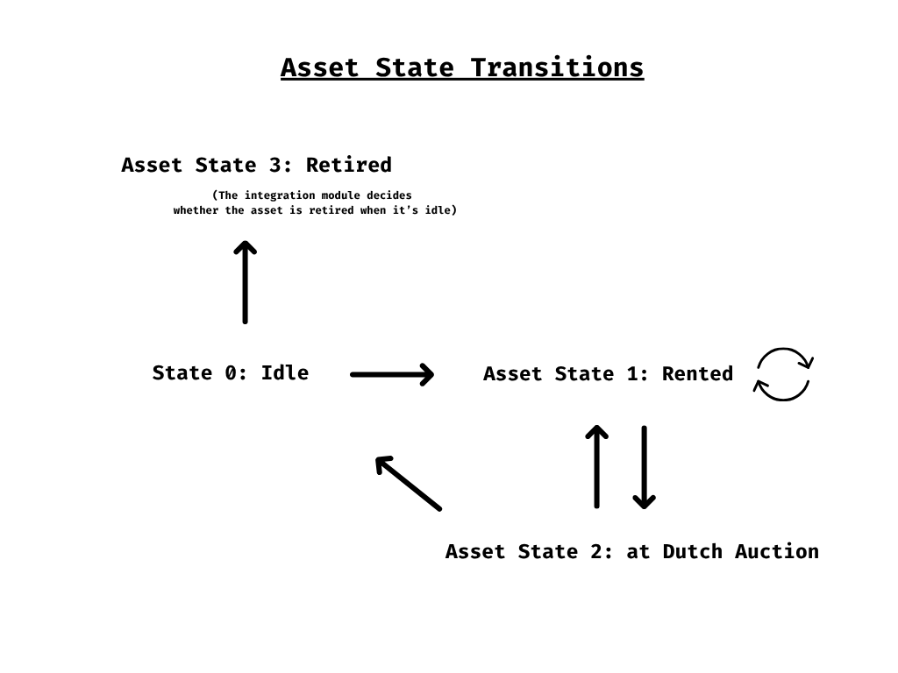
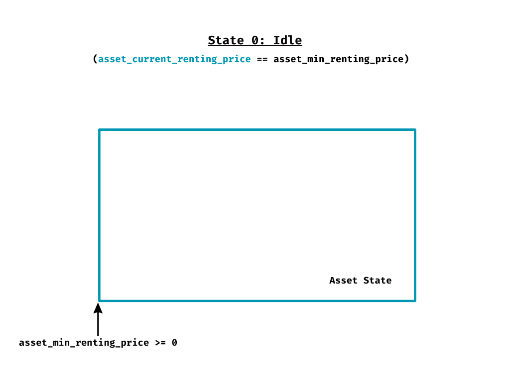
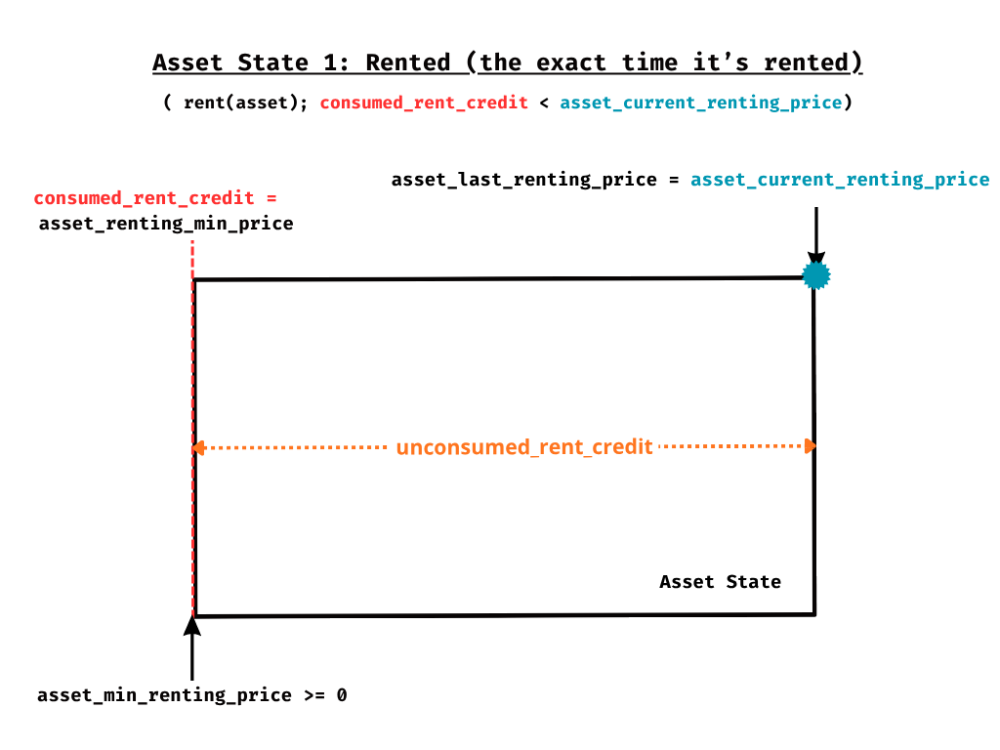
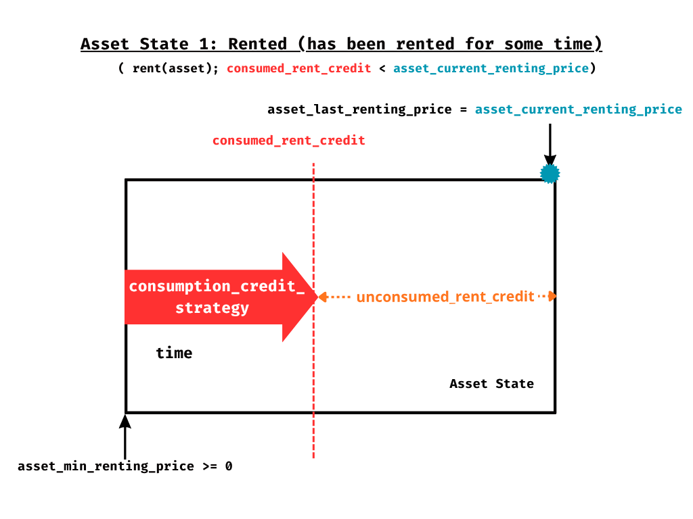
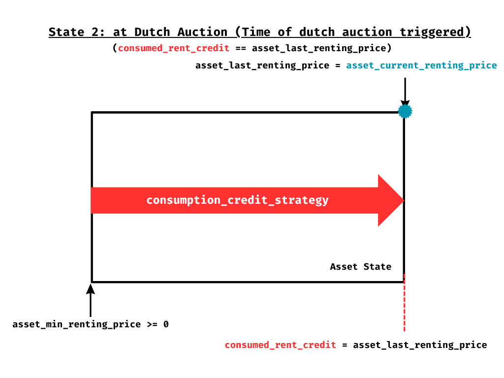
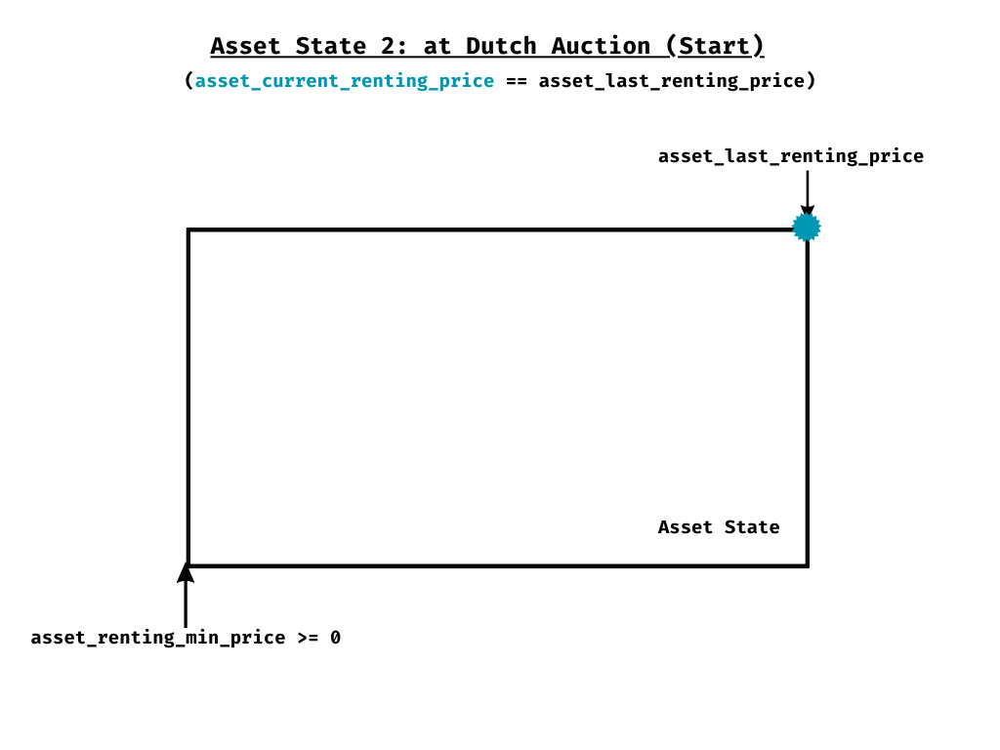
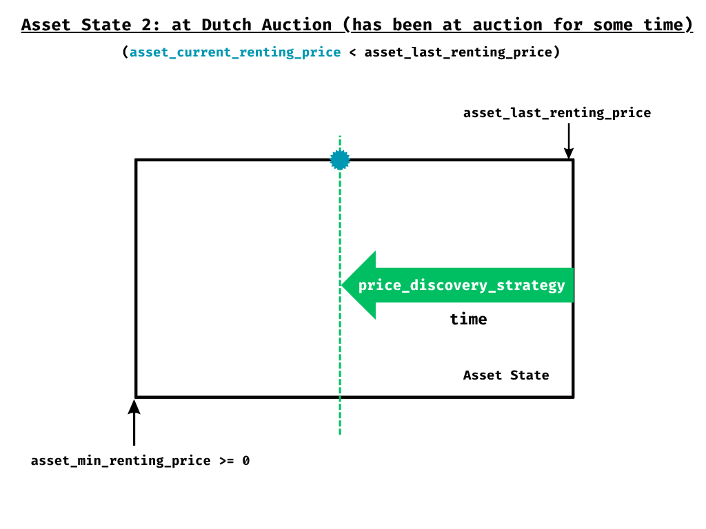
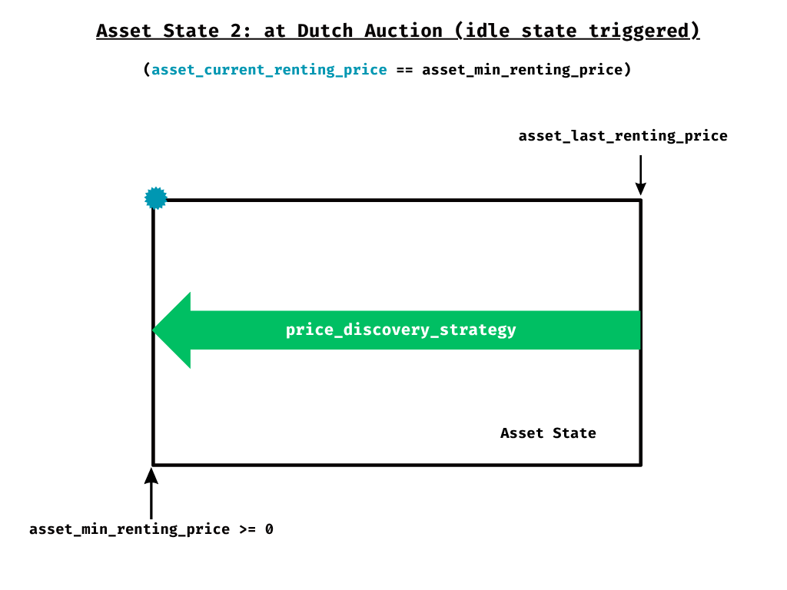

# Liquid Renting Protocol — Technical Specification

**Version:** 1.0.0-draft
**Target Runtime:** Sui Move
**Authors:** [Protocol Team]
**Status:** Draft — For Review

---
## Abstract

Historically, the right of full ownership (dominium) over an asset is grounded in three faculties defined by Roman law:

**Usus:** The right to use the asset without altering its essence or appropriating its fruits.

**Fructus:** The faculty to receive the yields or fruits the asset produces, whether natural or civil.

**Abusus:** The absolute attribute that defines the owner — the right to dispose of the asset (sell it, modify it, or destroy it).

The logic of contemporary leasing is not far from the ancient Roman locatio conductio rei: it consists of a temporary and fragmented transfer of these faculties. In a traditional arrangement, the lessor (owner) retains the abusus, while the lessee (tenant) temporarily acquires the right over the usus and fructus.

The process of renting an asset has historically been governed by two implicit assumptions:

**Rigid temporality:** The rental occurs for a fixed and predetermined period of time.

**Exclusivity:** During that period, the tenant holds an exclusive monopoly over the usus and fructus of the asset.

Liquid Renting Protocol challenges both assumptions. This protocol redefines the traditional rules of renting, introducing a dynamic model that loosens time constraints and breaks the exclusivity of usus and fructus over a rented asset.

---

## Table of Contents

1. [Motivation](#1-motivation)
2. [Core Principles](#2-core-principles)
3. [Asset State Flow - High Level](#3-asset-state-flow-high-level)
4. [Asset State Flow - Low Level](#4-asset-state-flow-low-level)
5. [Incentive-driven Functions](#5-incentive-driven-functions)

---

## 1. Motivation

The rental market generates a problem inherent to its own nature. Demanding total exclusivity over the usus and fructus of an asset inevitably creates an illiquidity problem. Rented assets cannot remain on sale or open for negotiation, since their rights of use and enjoyment are locked within a temporary monopoly.

How can the usus and fructus of a rented asset be kept liquid and on the market while their exclusive right temporarily belongs to someone? And if this were possible without punitive models for the current tenant, we would achieve:

**Continuous and uninterrupted liquidity:** Transforming a static market into a dynamic one, where usage rights can be traded in real time without requiring the termination of the original contract.

**Efficient secondary markets:** Allowing the current tenant to transfer, sell, or delegate their position to a third party without friction, giving them a fair exit path and recovering the value of unused time.

**Maximization of capital efficiency:** The asset is never economically immobilized. The market can continue discovering the real rental price based on current supply and demand, not past estimates.

This is possible, and it is called **Liquid Renting**.

---

## 2. Core Principles

The Liquid Renting model is designed to apply fundamentally to rental assets that meet the following non-negotiable principles:

**Utility-grounded value:** The intrinsic value of the asset must reside strictly in its capacity to be used (usus) and in the yields or cash flows derived from it (fructus), rather than in mere speculation over its ownership.

**Proven organic demand:** The asset must generate genuine interest and possess real traction. The protocol optimizes liquidity, fractions time, and eliminates friction — but operates under an immutable economic premise: no technology or protocol can create sustainable demand for an asset that lacks a market.

## Protocol Purpose

The protocol has been designed as a new modular DeFi infrastructure primitive. Its goal is to provide a standardized Liquid Renting logic layer that can be integrated agnostically by any ecosystem.

By importing this module, developers can equip their native assets with a liquid rental architecture, allowing utility (usus) and yield (fructus) to flow programmatically without compromising the asset's availability in the market.

---

## 3. Asset State Flow (High-Level View)

The lifecycle of an asset within the Liquid Renting protocol is governed by a strict state flow. This model ensures that the transfer of usus and fructus executes predictably, maintaining continuous liquidity of the asset.

The following details the state machine through which any integrated asset transitions:

### 1. State Definitions (Asset States)

**State 0: Idle (Baseline / Price Floor):**
The entry or resting state. The asset is available at the base rental price. No usage right is committed. The usus and fructus are waiting for a first tenant to inject the liquidity necessary to activate the protocol.

**State 1: Rented (Position Secured):**
The tenant has acquired the monopoly over usus and fructus through upfront liquidity injection. In this state, the tenant does not trade the asset — they enjoy its utility while their position remains active. The injected liquidity is bound to the asset, and the tenant enjoys use of the asset until a new renter pays a higher price for it, at which point the usus is revoked from the previous tenant through a compensation mechanism explained below.

**State 2: At Dutch Auction (Price Discovery):**
A market rebalancing mechanism. If the asset is no longer rented and the market does not validate the last known rental price, a descending Dutch Auction is triggered. The goal is to perform a dynamic liquidation of the rental price until a new equilibrium is found where demand once again absorbs the usus of the asset.

**State 3: Retired (Off-boarding):**
The exit state from the protocol. An asset can only be retired when it is in the Idle state (no active usage commitments). At this point, the integration module revokes rental permissions and the usus/fructus is reintegrated into the absolute domain (abusus) of the original issuer or owner, exiting the protocol's liquidity circuit.

### 2. State Transitions

The flow of the asset between states obeys strict rules of liquidity and time, ensuring the market always has the final word on the value of the usus.

**Idle ➔ Rented (Initial Activation):**
A user injects the initial liquidity corresponding to the asset's base rental fee. The protocol assigns the usus and fructus, initiating a rental time block that is fixed and immovable by the protocol's architecture.

**Rented ↺ (Takeover / Market Relay):**
Even while the asset is rented, its usus remains liquid. If the market values the asset above the current price, a new tenant can inject liquidity at a higher price. In doing so:

- The last known rental price in the protocol is updated.
- A new full time block is initialized for the new tenant.
- The displaced tenant is economically compensated: they receive the full value of their unconsumed_rent_credit (the value of unused time) plus 100% of the difference between their entry price and the new price.

Note: The physical transfer of the right is governed by a notice_period that determines the exact time of the handover, calculated as min(notice_period_parameter, remaining_time). Notice_period >= 0.

**Rented ➔ At Dutch Auction (Exhaustion and Liquidation):**
This transition is triggered when the current tenant's time block ends (all their unconsumed_rent_credit is exhausted) and the market has not validated or exceeded the last known price. The protocol sends the asset to auction to initiate a descending price curve that attracts new demand.

**At Dutch Auction ➔ Rented (Price Discovery):**
During the auction, a new buyer accepts the current descending price and injects the required liquidity. They automatically assume the usus of the asset, initiating a new time block and returning the system to State 1.

**At Dutch Auction ➔ Idle (Lack of Demand):**
If the auction descends to the lower bound (price floor) and the market does not absorb the asset, it returns to the Idle state, waiting for reactivation.

**Idle ➔ Retired (Delisting):**
From the resting state, the integration module evaluates the asset's situation. If it determines that no real market or genuine interest exists to justify its continued presence, it executes the asset's permanent withdrawal from the protocol.

---

## 4. Asset State Flow (Low-Level View)

At a deeper level, the Liquid Renting architecture operates as a dynamic equilibrium system between consumed time and market valuation.

### 1. The Resting State (State 0: Idle)

The initial equilibrium point. The asset_current_renting_price equals the asset_min_renting_price. The asset is "open" with no liquidity barrier protecting its usus.

### 2. The Consumption and Competition Cycle (State 1: Rented)

Once a user injects liquidity, the asset enters a state of active utilization that is, by definition, a renewable cycle:

**Price as Entry Barrier:** When renting the asset, the user purchases at next_renting_price(), establishing a new asset_last_renting_price. This value acts as a physical liquidity barrier: any other actor wishing to access the usus of the asset must "clear" this barrier by injecting capital greater than next_renting_price(). A higher price than next_renting_price() is allowed.

**The Takeover Dynamic (Cycle Reactivation):** If a new renter pays a higher price before the time runs out, the cycle restarts instantaneously:

- The new price becomes the new "barrier" (asset_last_renting_price).
- The consumption vector (Red Arrow) — consumption_credit_strategy — resets to zero.
- The new tenant receives a full block of unconsumed_rent_credit.

**The Trigger:** The transition to auction only occurs if the market does not validate the asset_last_renting_price known. That is, if no one clears the barrier established by the last tenant before their consumed_rent_credit reaches the limit of asset_last_renting_price. In practice, the current tenant only reaches the end of the road if they were the last one to establish asset_last_renting_price.

### 3. Price Discovery (State 2: At Dutch Auction)

When the entry barrier (the price) proves too high for current demand and the last tenant's consumed_rent_credit is exhausted, the protocol initiates the liquidation:

**Descent Strategy (Green Arrow):** The price_discovery_strategy begins eroding the entry barrier. The asset_current_renting_price descends from the last known maximum.

**Resolution:** The moment the descending price reaches a point the market finds attractive, a new user injects that liquidity, the asset returns to State 1, and a new entry barrier is established — restarting the utility cycle. Otherwise, the asset_current_renting_price equals the asset_min_renting_price and the asset enters the Idle state.

---

------------------TODO---------------Incentive-driven functions
